# 통계학 1주차 정규과제

📌통계학 정규과제는 매주 정해진 분량의 『*데이터 분석가가 반드시 알아야 할 모든 것*』 을 읽고 학습하는 것입니다. 이번 주는 아래의 **Statistics_1st_TIL**에 나열된 분량을 읽고 `학습 목표`에 맞게 공부하시면 됩니다.

아래의 문제를 풀어보며 학습 내용을 점검하세요. 문제를 해결하는 과정에서 개념을 스스로 정리하고, 필요한 경우 추가자료와 교재를 다시 참고하여 보완하는 것이 좋습니다.

1주차는 `1부. 데이터 기초체력 기르기`를 읽고 새롭게 배운 내용을 정리해주시면 됩니다.


## Statistics_1st_TIL

### 1부. 데이터 기초체력 기르기
### 01. 통계학 이해하기
### 02. 모집단과 표본추출
### 03. 변수와 척도
### 04. 데이터의 기술 통계적 측정
### 05. 확률과 확률변수

## Study Schedule

|주차 | 공부 범위     | 완료 여부 |
|----|----------------|----------|
|1주차| 1부 p.2~56     | ✅      |
|2주차| 1부 p.57~79    | 🍽️      | 
|3주차| 2부 p.82~120   | 🍽️      | 
|4주차| 2부 p.121~202  | 🍽️      | 
|5주차| 2부 p.203~254  | 🍽️      | 
|6주차| 3부 p.300~356  | 🍽️      | 
|7주차| 3부 p.357~615  | 🍽️      | 

<!-- 여기까진 그대로 둬 주세요-->

# 01. 통계학 이해하기

```
✅ 학습 목표 :
* 통계학의 필요성에 대해 인식한다.
* 기술통계와 추론통계의 특성을 구분할 수 있다.
```
<!-- 새롭게 배운 내용을 자유롭게 정리해주세요.-->
- 왜 통계학을 알아야 할까?
통계적 사고는 정확한 분석을 돕고, 문제점 해결과 도전의 성공확률을 높이기 때문.

- 머신러닝과 통계학의 차이
머신러닝의 주 목적: 예측 (정확성 중요. 모형 복잡하며 과적합 해결에 집중)
통계학 주 목적: 해석 (신뢰도 중요. 모형 단순성 추구, 통계적 적합성 집중)
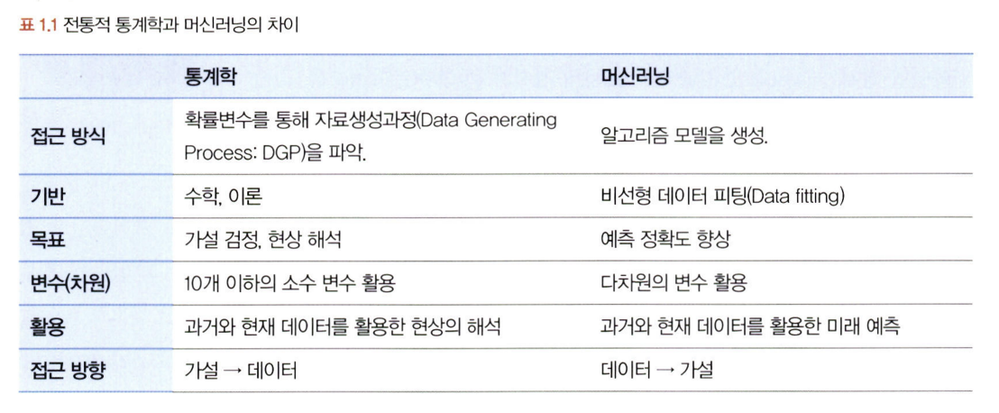

- 통계학의 정의와 기원
통계학이란? : 자료를 수집, 분석하여 분석결과를 통해 효율적  의사결정을 하는 기법
기원: 인구조사에서 발생. 기원전 약 3000년경. 이후 계속하여 발전
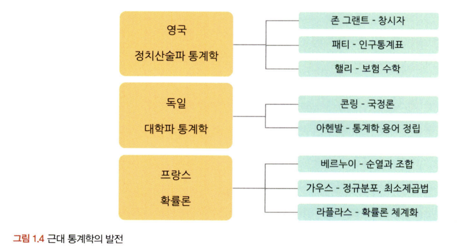

- 기술 통계화 추론 통계
기술통계: 데이터 특성을 사실에 근거해 설명, 묘사하는 것 (descriptive)
EDA: 탐색적 데이터 분석. 기술통계적 방법으로 데이터를 설명, 시각화 많이 사용
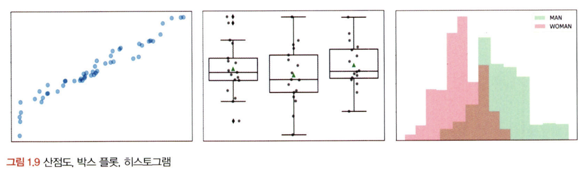

추론통계: 표본집단에서 모집단의 특성을 추론하는 것 (inferential)
표본의 특성을 분석 -> 특성의 일반화 여부 판단 -> 모집단의 특성으로 추정

# 02. 모집단과 표본추출

```
✅ 학습 목표 :
* 모집단과 표본의 정의와 관계를 설명할 수 있다.
* 편향과 분산의 차이를 설명할 수 있다.
```

<!-- 새롭게 배운 내용을 자유롭게 정리해주세요.-->
- 모집단과 표본, 전수조사와 표본조사
모집단: 분석 대상 전체의 집합
표본집단: 모집단의 일부 추출한 것
전수조사: 모집단 자료 전체 분석
표본조사: 표본을 통해 모집단 정보 추정, 검정
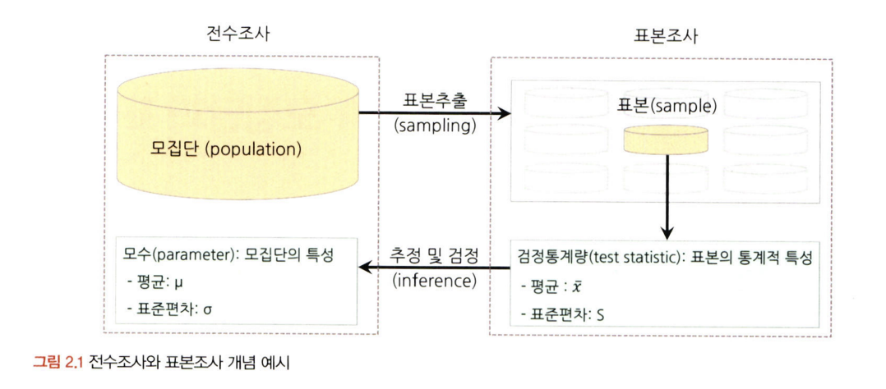

- 표본조사를 하는 이유와 데이터과학 적용 방법
분석 모델이 완성될 때까지 표본 데이터를 활용하는 것이 경제적, 시간적으로 유리
전체 과정 중 예측 및 분류 모델링 단계에서는 적절한 모델 추출, 진행
전체 프로세스 완성 후 전체 데이터 사용해 최종적 모델 성능 확인 및 예측, 분류
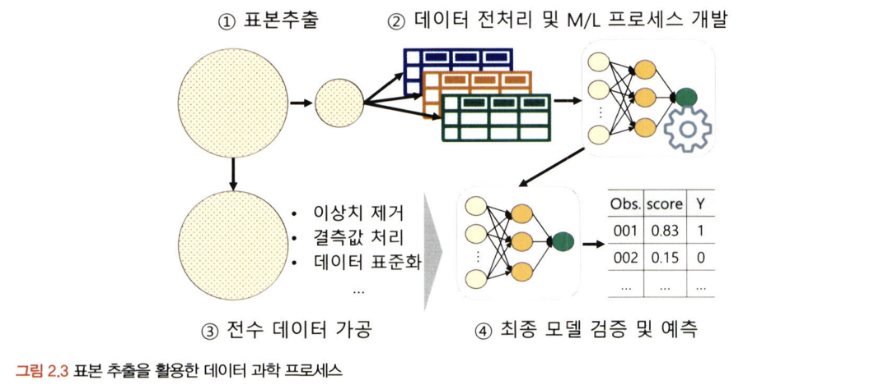

- 표본추출에서 나타나는 편향의 종류
표본오차(sampling error): 모집단과 표본의 자연발생적인 변동
비표본오차 (non - sampling error): 표본오차를 제외한 변동
편향 (bias): 표본에서 나타나는 모집단과의 체계적 차이
편향에는 표본 추출 편향, 가구편향, 무응답편향, 응답편향 등이 존재
브래들리 효과: 피조사자가 거짓된 응답을 하는 현상
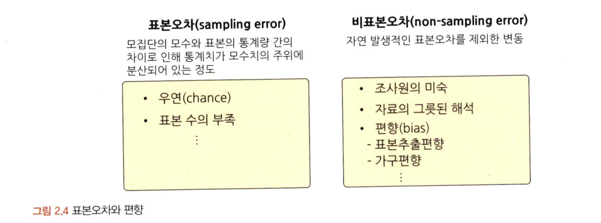

- 인지적 편향의 종류
확증편향: 본래 믿고 있는대로 정보 선택적으로 받아들임.
기준점 편향: 분석가가 가장 처음에 접하는 정보에 매몰되는 현상.
선택 지원 편향: 긍정적 부분 많이 생각, 결정 반대 증거 무시 편향
분모 편향: 분수 전체가 아닌 분자에만 집중하여 현황을 왜곡
생존자 편향: 소수의 성공한 사례를 일반화한 것으로 인식

- 머신러닝 모델 측면의 편향과 분산
모델 복잡도 상승시 편향 감소, 분산 증가
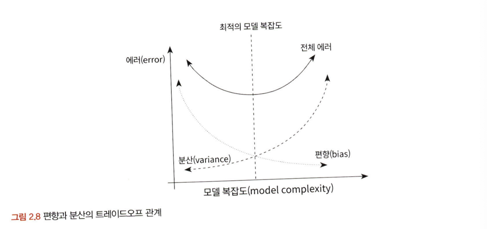

- 표본 편향을 최소화하기 위한 표본 추출 방법
두가지 관점에서 바라보기
1. 데이터 수집 단계의 표본 추출
2. 기존에 가지고 있는 데이터에서 적절한 크기 표본 데이터 추출
모집단, 표본 프레임 확정 후 확률 표본추출방법 선택해야 함.

표본추출방법의 종류
단순 임의 추출방법: 랜덤하게 뽑음. 가장 쉽고 일반적으로 사용
계층적 표본추출방법: 일정한 간격으로 표본을 선택
층화 표본추출방법: 특정한 기준으로 분류 가능할 때 사용
군집 표본추출방법: 모집단 기준 분리 후 소집단 선택해 분석
복원추출법, 비복원추출법
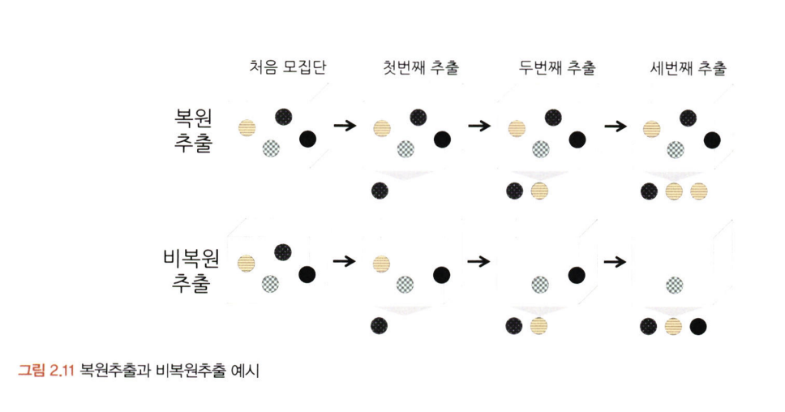

# 03. 변수와 척도
```
✅ 학습 목표 :
* 독립변수, 종속변수의 관계를 파악할 수 있다.
* 척도(변수의 데이터적 속성)의 종류를 설명할 수 있다.
```
<!-- 새롭게 배운 내용을 자유롭게 정리해주세요.-->
- 변수의 종류
변수의 관계적 측면: 독립변수 -> 종속변수
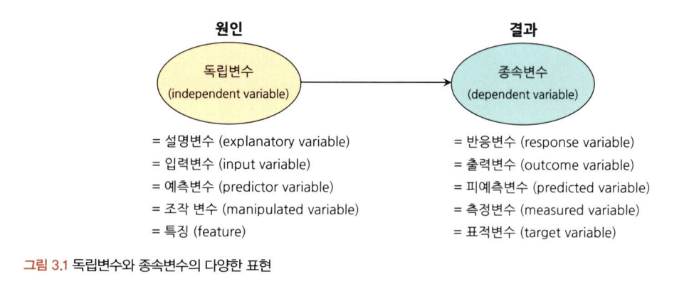

- 변수 관계의 종류
인과관계: 독립변수, 종속변수의 기본적 관계. 원인과 결과 관계 규명
상관관계: 변수 간의 관련성 존재. 인과관계의 상위 개념. 음, 양의 관련을 갖고 있음.
독립관계: 변수 간의 상관성, 상관계수 0
의사관계: 변수 간에 상관성은 있지만 다른 변수에 의해 나타남.
양방향적 의사관계: 두 변수가 서로간의 인과적 영향을 미치는 관계
조절관계, 매개관계
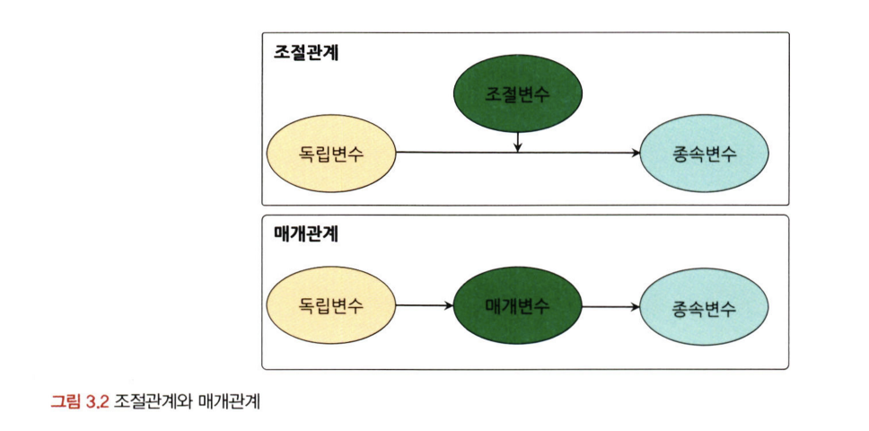

- 척도의 종류
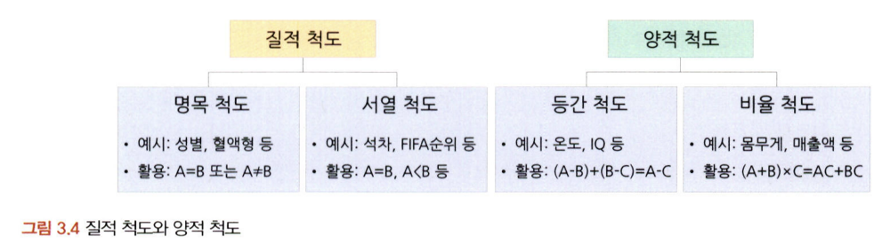
명목척도: 조사대상 속성, 범주 구분 목적. 정보량이 적음
서열척도: 속성 크기 측정해 대상 순서관계 측정. 구분 가능
등간척도: 서열척도 정보 + 상대적 크기 차이 비교 가능
비율척도: 가장 많은 정보. 순서, 상대적 크기, 정대적 기준을 통한 비율 정보 포함
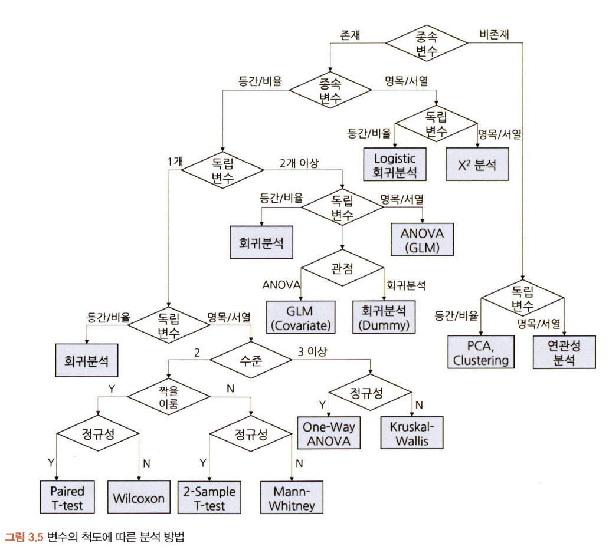

# 04. 데이터의 기술 통계적 측정

```
✅ 학습 목표 :
* 산포도의 의미를 설명하고 측정방법을 나열할 수 있다.
* 정규분포의 왜도값과 첨도값이 얼마인지 답할 수 있다.
```

<!-- 새롭게 배운 내용을 자유롭게 정리해주세요.-->
- 중심 성향의 측정
평균값, 최빈값, 중앙값 사용
산술평균: 가장 기본적 평균 측정 방법
가중평균: 가중치를 더해 평균값 구함
기하평균: 시간에 따라 비율적으로 변화하는 값의 평균
조화평균: 기하평균과 비슷하나 값의 평균을 구함

- 분산과 표준편차
분산: 산술평균과 각 데이터의 편차를 제곱한 것의 평균
편차: 모두 더하면 0.
표준편차: 분산의 제곱근 값. 실제 편차의 규모와 유사하게 조정

- 산포도와 범위, 사분위수, 변동계수
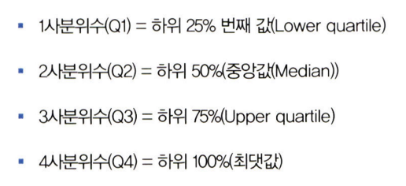
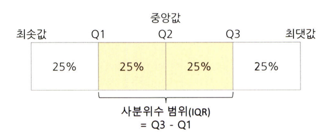
변동계수: 표준편차를 산술평균으로 나눈 값

- 왜도와 첨도
왜도: 데이터 분포의 좌우 비대칭도 표현 척도
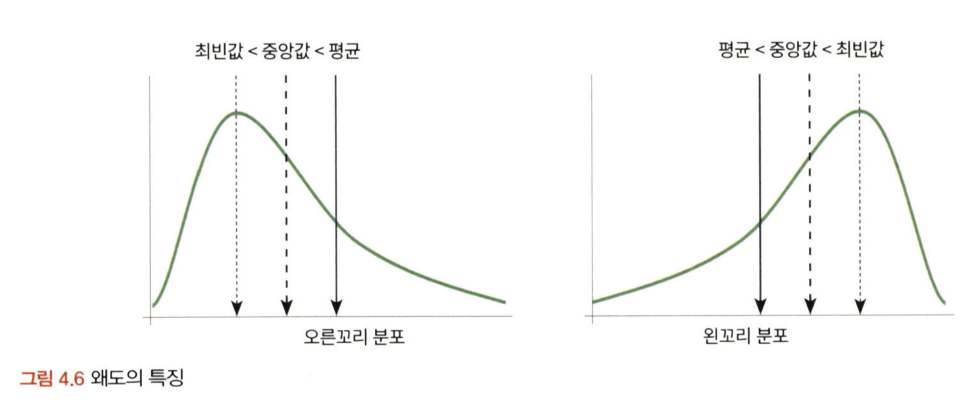
첨도: 정규분포보다 얼마나 뾰족하고 완만한지를 나타냄. 얼마나 집중적으로 쏠려있는가.
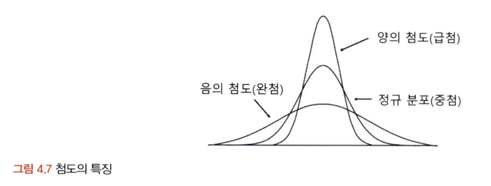

- 표준편차의 경험법칙
표본 크기 최소 100 이상은 되어야 성립

# 05. 확률과 확률변수

```
✅ 학습 목표 :
* 확률변수의 개념과 종류를 설명할 수 있다.
* 심슨의 역설을 설명하고, 발생 원인을 식별하며, 이를 해결하기 위한 방안을 도출할 수 있다.
```

<!-- 새롭게 배운 내용을 자유롭게 정리해주세요.-->
- 확률의 기본 개념
확률: 일정한 조건 안에서 특정 사건이 일어날 수 있는 가능성의 정도
표본공간: 통계적 실험을 통해 발생할 수 있는 모든 사건의 집합
표본 점(사건): 한 번의 실험을 통해 발생할 수 있는 특정한 결과 혹은 표본공간의 부분집합

- 확률의 종류
비조건확률: 아무런 조건이 없는 상황에서 사건이 일어날 확률 (한계확률)
결합확률: 표본공간 안에서 일어나는 사건 각각의 조합으로 이루어지는 확률
조건부 확률: 하나의 사건이 먼저 발생 -> 또 다른 사건 발생 확률

- 분석과 베이지안 이론
분할: 사건을 모두 합했을 때 전체 사건 포괄, 중복이 일어나지 않는 사건 집합
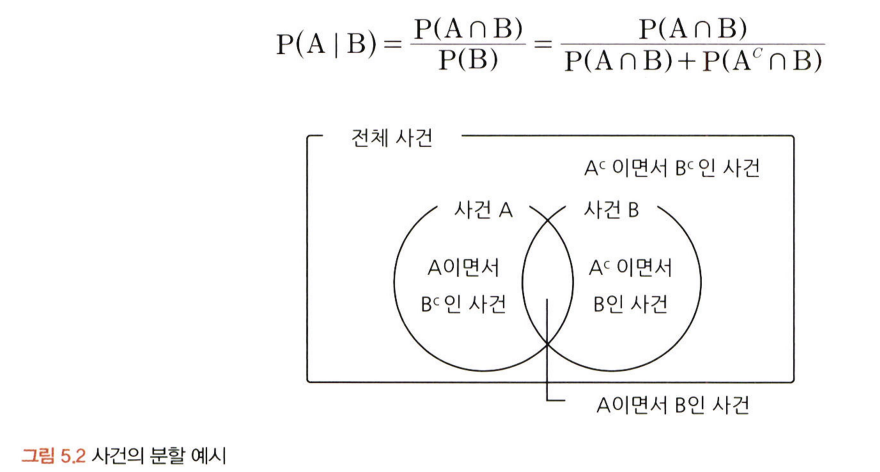

- 베이지안 이론 
사전확률 -> 새로운 정보(우도확률) -> 베이즈 정리의 응용 -> 사후확률

- 광고의 예, 질병 양성 확률 구하기의 예

- 확률변수의 개념과 종류
확률 변수의 값은 표본 공간의 크기에 따라 특정 값이 나올 수 있는 확률이 달라짐.

-심슨의 역설
데이터를 어떻게 나누고 결합하고 가공하는가에 따라 결과가 정반대로 바뀔 수 있음.


<br>
<br>

# 확인 문제

## 문제 1.

> **🧚Q. 한 대형 병원이 두 명의 외과 의사(A와 B)의 수술 성공률을 비교하려고 한다. 과거 1년간의 데이터를 보면, A 의사의 전체 수술 성공률은 80%, B 의사의 전체 수술 성공률은 90%였다. 이 데이터를 본 병원 경영진은 A 의사의 실력이 B 의사보다 별로라고 판단하여 A 의사의 수술 기회를 줄이는 방향으로 정책을 조정하려 한다.
그러나 일부 의료진은 이 결론에 의문을 제기했다.
그들은 "단순한 전체 성공률이 아니라 더 세부적인 데이터를 분석해야 한다"고 주장했다.**

> **-A 의사의 실력이 실제로 B 의사보다 별로라고 결론짓는 것이 타당한가?   
-그렇지 않다면, 추가로 확인해야 할 정보는 무엇인가?**

<!--심슨의 역설을 이해하였는지 확인하기 위한 문제입니다-->

<!--학습한 개념을 활용하여 자유롭게 설명해 보세요. 구체적인 예시를 들어 설명하면 더욱 좋습니다.-->

```
여기에 답을 작성해주세요!
```
A의사의 실력이 B의사보다 떨어진다고 결정하는 것은 타당하지 않습니다. 단편적인 수술성공률은 B의사가 더 높지만 전체적인 수치 뿐 아니라 세부적인 데이터를 보아야 합니다. 본 문제처럼 데이터를 어떻게 나누고 결합하고 가공하는가에 따라 결과가 정반대로 바뀔 수 있는 현상을 심슨의 역설이라 합니다. 

이 경우에도 심슨의 역설이 발생했을 가능성을 고려해야 합니다. 예를 들어 A의사가 더 어려운 수술을 맡았을 수 있고, 각 의사의 수술 횟수가 많이 차이가 날 수도 있습니다. 이 때문에 단순한  전체 수술 성공률 말고 나머지도 확인해야 합니다. 수술 난이도별로 수술 성공률의 차이를 분석하는 등의 복합적인 분석이 필요합니다.
### 🎉 수고하셨습니다.