# 통계학 2주차 정규과제

📌통계학 정규과제는 매주 정해진 분량의 『*데이터 분석가가 반드시 알아야 할 모든 것*』 을 읽고 학습하는 것입니다. 이번 주는 아래의 **Statistics_2nd_TIL**에 나열된 분량을 읽고 `학습 목표`에 맞게 공부하시면 됩니다.

아래의 문제를 풀어보며 학습 내용을 점검하세요. 문제를 해결하는 과정에서 개념을 스스로 정리하고, 필요한 경우 추가자료와 교재를 다시 참고하여 보완하는 것이 좋습니다.

2주차는 `1부. 데이터 기초체력 기르기`를 읽고 새롭게 배운 내용을 정리해주시면 됩니다.


## Statistics_2nd_TIL

### 1부. 데이터 기초체력 기르기
### 06. 확률분포
### 07. 가설검정

## Study Schedule

|주차 | 공부 범위     | 완료 여부 |
|----|----------------|----------|
|1주차| 1부 p.2~56     | ✅      |
|2주차| 1부 p.57~79    | ✅      | 
|3주차| 2부 p.82~120   | 🍽️      | 
|4주차| 2부 p.121~202  | 🍽️      | 
|5주차| 2부 p.203~254  | 🍽️      | 
|6주차| 3부 p.300~356  | 🍽️      | 
|7주차| 3부 p.357~615  | 🍽️      |

<!-- 여기까진 그대로 둬 주세요-->

# 06. 확률분포

```
✅ 학습 목표 :
* 이산확률분포의 종류와 특징을 설명할 수 있다.
* 연속확률분포의 종류와 특징을 설명할 수 있다. 
* 중심극한정리(CLT)의 개념을 이해하고 설명 할 수 있다.
```
- 확률분포란: 확률변수가 특정 값을 가질 확률
통계적 모형의 기본 통계가 됨.

- 확률 분포는 확률변수가 가질 수 있는 값들의 특성에 따라 이산확률분포/연속확률분포로 구분
- 이산확률변수는 확률질량함수로 표현 가능. (이항분포, 초기하분포, 포아송 분포 등)
- 연속확률분포는 확률밀도함수로 표현 가능. (정규분포,t분포, 카이제곱 분포 등이 있음)
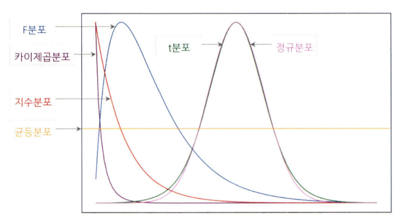

- 지수분포: 지수적으로 계속 감소 형태. 
- t 분포: 정규분포와 거의 동일한 형태. 평균에 대한 신뢰구간 추정 및 가설검정 분포
자유도 n이 커질 때마다 정규분포 형태에 수렴.
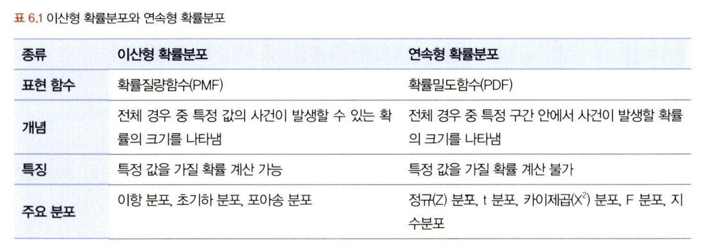

## 6.2. 이산확률분포

> **🧚 이산확률분포에 대해 학습한 내용을 정리해주세요.**

<!--수식과 공식을 암기하기보다는 분포의 개념과 특성을 위주로 공부해주세요. 분석 대상의 데이터가 어떠한 확률분포의 특성을 가지고 있는지를 아는 것이 더 중요합니다.-->
##### 균등분포
x가 동일한 확률을 가지는 분포
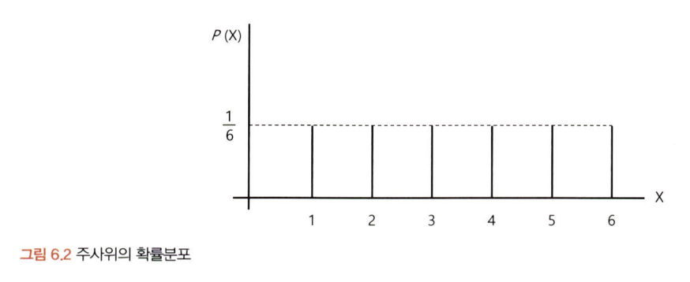

##### 이항분포
1,0의 값만을 갖는 분포
- 베르누이 실행: 이항분포를 나타내는, 결과가 두가지 중 하나만 나오는 시행
(시행 성공=1, 실패=0) 확률의 합은 항상 0
각각의 결과가 독립적으로 이루어짐. 복원추출

-이항공식
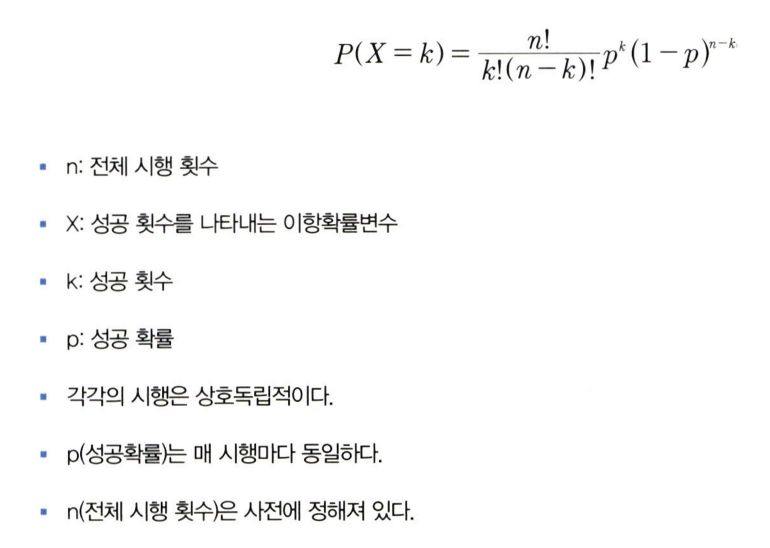

##### 초기하분포
각 시행이 독립적이지 않아 성공할 확률이 달라짐.
비복원추출

##### 포아송분포
일정한 관측 공간에서 특정 사건이 발생하는 횟수
성공과 실패, 1,0 개념 존재x, 표본크기 개념x
- 모든 사건은 독립, 발생 사건은 양의 정수, 해당 시공간 사건 발생 확률 동일, 한번에 둘 이상 사건 x
-람다 기댓값을 통해 계산 가능
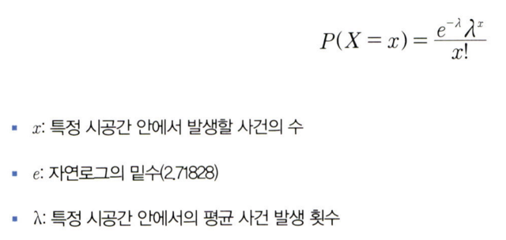

## 6.3. 연속확률분포

> **🧚 연속확률분포에 대해 학습한 내용을 정리해주세요.**

<!--수식과 공식을 암기하기보다는 분포의 개념과 특성을 위주로 공부해주세요. 분석 대상의 데이터가 어떠한 확률분포의 특성을 가지고 있는지를 아는 것이 더 중요합니다.-->
확률변수 x가 특정 구간에 속할 확률
전체 분포에서 특정 구간인 a에서 b의 사건이 발생할 수 있는 확률 구하기 
확률 밀도 함수 (PDF)

##### 정규분포
가장 대표적인 연속확률분포
동전을 던지는 횟수를 무한히 던지면 정규분포 형태가 만들어짐.

- 정규분포 성립하는 조건
평균을 중심으로 좌우대칭의 종 모양 형태
품질혁신(식스 시그마), 평균에서 좌우로 6표준편차의 확률만큼 제품 품질 유지
정규분포는 그래프 면적 계산하여 확률 구함. 표준화 필요
표준정규분포: 평균이 0, 분산이 1인 형태로 변환

##### 지수분포
특정 사건이 발생한 시점으로부터 다음 사건이 발생할 때까지의 시간을 확률변수값으로 하는 분포
다음사건이 일어날 때 까지의 대기시간

- 람다
포아송: 일정 시간동안 평균적으로 발생하는 사건의 횟수
역수 취하면 하나 사건 발생 후 다음 사건 발생의 평균 소요시간이 됨.
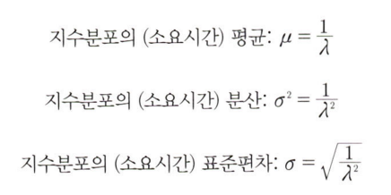

- 지수분포상 실제확률 구하기
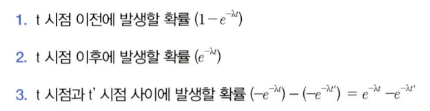
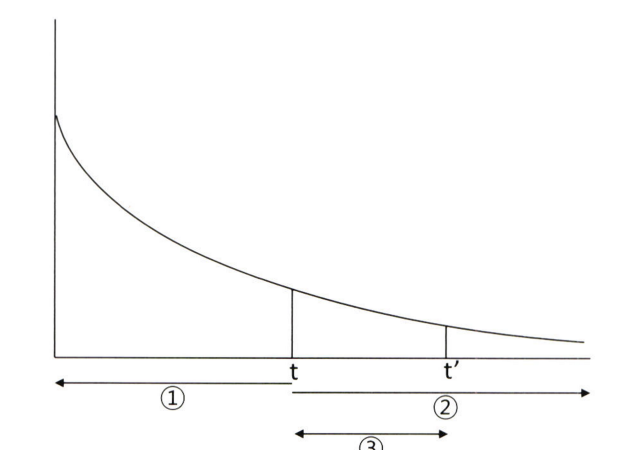
3가지 경우로 나누어 상황에 맞게 정리하기

## 6.4. 중심극한정리

> **🧚 중심극한정리에 대해 학습한 내용을 정리해주세요.**
표본의 통계치를 통해 어떻게 모집단을 추출할까?

- 중심극한정리
데이터의 크기가 일정한 양을 넘으면 평균의 분포는 정규분포에 근사한다.
표본을 여러번 추출했을 때, '각각의 표본' 평균들의 분포가 정규분포를 이룬다.
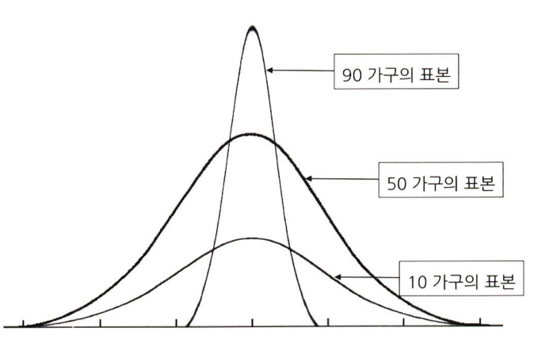

중심극한정리는 추정, 가설검정을 위한 핵심이론이다.

# 07. 가설검정

```
✅ 학습 목표 :
* 귀무가설과 대립가설의 개념을 정의하고, 주어진 연구 질문에 적절한 가설을 설정할 수 있다.
* 가설검정의 유의수준과 p값의 개념을 설명하고, p값을 해석하여 귀무가설을 기각할지 여부를 판단할 수 있다.
* 1종 오류와 2종 오류의 차이를 설명하고, 실제 사례에서 어떤 오류를 더 중요하게 고려해야 하는지 판별할 수 있다.
```

<!-- 새롭게 배운 내용을 자유롭게 정리해주세요.-->
##### 귀무가설과 대힙가설
가설: 둘 혹은 그 이상의 변수들 간의 관계에 대한 잠정적 결론

- 데이터 분석의 목적 4가지
기술적 분석: 과거나 현재 어떤 일이 일어났는지 파악 위한 분석 (분포, 추세)
진단적 분석: 과거나 현재 발생 사건 원인을 밝히기 위한 분석 (인과관계)
예측분석: 미래 어떤 일이 어떤 확률로 일어날지 예측. 결과 가능성
처방적 분석: 예측되는 미래 결과를 위해 어떻게 하면 좋을지. 제한된 자원으로 최적의 성과
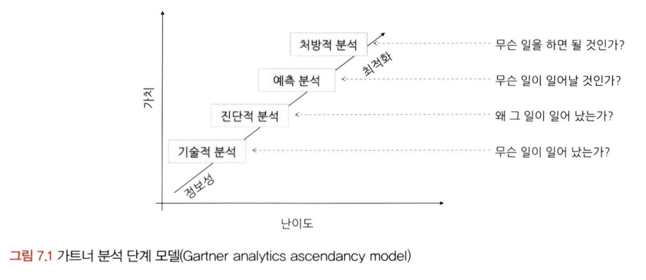

- 통계학 가설 검정의 궁극적 목표
기존의 주장 vs 새로운 주장 무엇이 맞는지 검정
두가지 가설 필요. (귀무가설/ 대립가설)

귀무가설 -> H0
새롭게 증명하고자 하는 가설과 반대되는 가설

대립가설 -> H1, H2
귀무가설이 기각됐을때 대안적으로 채택되는 가설

##### 가설검정의 절차


유의수준: 0.1, 0.05, 0.01 등으로 설정
귀무가설과 같이 나올 확률이 5% 미만 : p>.05
t-test, ANOVA 사용하여 평균 차이 검정

- 예시로 보는 가설 검정 프로세스
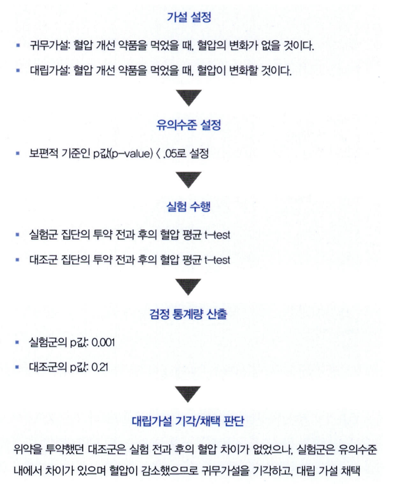

##### 가설검정의 유의수준과 p값
가설검정: 가설이 통계적으로 옳은가를 판별하기 위한 방법
귀무가설에 대한 p값이 유의수준 안에 들어오는지에 따라 가설 기각, 채택 판별
유의수준
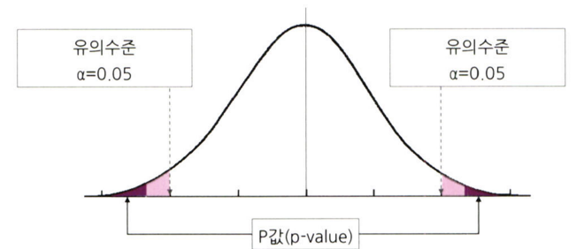

- 신뢰수준
유의수준과 반대되는 기준. 
유의수준과 신뢰수준 합하면 100%

귀무가설 기각역 설정에 따라 왼쪽꼬리 검정, 오른쪽꼬리 점정, 양측 검정으로 구분됨.
한쪽만 하면: 단측검정

##### 1종 오류와 2종 오류
귀무가설이 옳아도 틀렸다고 검정결과가 나올 수 있고
귀무가설이 틀려도 옮다고 검정결과가 나올 수 있음.

- 1종 오류: 귀무가설이 참임에도 불구하고 귀무가설을 기각하는 오류
- 2종 오류: 귀무가설이 거짓임에도 귀무가설을 채택하는 오류

1종 오류가 발생할 확률은 알파. 유의수준과 동일한 지표
단순한 귀무가설에서 a는 1종 오류가 일어날 확률을 뜻하지만, 복합적인 귀무가설의 경
우에는 a가 1종 오류가 발생할 확률의 최대치를 의미함.

2종 오류가 발생할 확률 베타. 
가설검정의 검정력(power)이 커질수록 줄어들게 됨.
검정력은 귀무가설이 거짓일 때 귀무가설을 기각할 확률을 의미
유의 수준, 즉 기각역이 주어지면 표본이 늘어나지 않는 이상 자동으로 결정됨.

알파, 베타 값은 트레이드 오프 관계

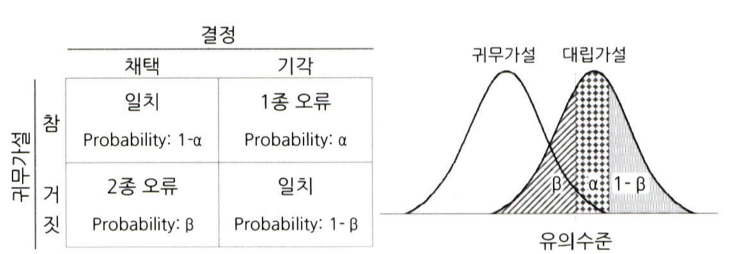

일반적으로 유의수준(α)은 0.05, 1-검정력(ẞ)은 0.2 기준을 사용


<br>
<br>

# 확인 문제

## 문제 1.

> **🧚Q. 다음 중 귀무가설(H₀)을 기각해야 하는 경우는 언제인가요? 정답을 고르고, 그 이유를 간단히 설명해주세요.**

> **1️⃣ 유의수준(α)이 0.05이고, p값이 0.03일 때   
2️⃣ 유의수준(α)이 0.01이고, p값이 0.02일 때**

```
여기에 답을 작성해주세요!
```

### 🎉 수고하셨습니다.
