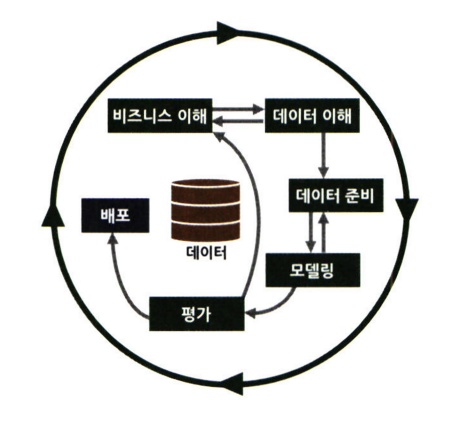
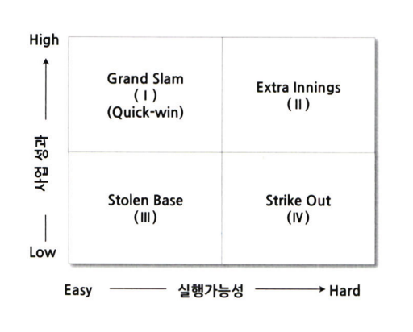

# 통계학 3주차 정규과제

📌통계학 정규과제는 매주 정해진 분량의 『*데이터 분석가가 반드시 알아야 할 모든 것*』 을 읽고 학습하는 것입니다. 이번 주는 아래의 **Statistics_3rd_TIL**에 나열된 분량을 읽고 `학습 목표`에 맞게 공부하시면 됩니다.

아래의 문제를 풀어보며 학습 내용을 점검하세요. 문제를 해결하는 과정에서 개념을 스스로 정리하고, 필요한 경우 추가자료와 교재를 다시 참고하여 보완하는 것이 좋습니다.

2주차는 `2부-데이터 분석 준비하기`를 읽고 새롭게 배운 내용을 정리해주시면 됩니다.


## Statistics_3rd_TIL

### 2부. 데이터 분석 준비하기
### 08. 분석 프로젝트 준비 및 기획
### 09. 분석 환경 세팅하기


## Study Schedule

|주차 | 공부 범위     | 완료 여부 |
|----|----------------|----------|
|1주차| 1부 p.2~56     | ✅      |
|2주차| 1부 p.57~79    | ✅      | 
|3주차| 2부 p.82~120   | ✅      | 
|4주차| 2부 p.121~202  | 🍽️      | 
|5주차| 2부 p.203~254  | 🍽️      | 
|6주차| 3부 p.300~356  | 🍽️      | 
|7주차| 3부 p.357~615  | 🍽️      |  

<!-- 여기까진 그대로 둬 주세요-->

# 08. 분석 프로젝트 준비 및 기획

```
✅ 학습 목표 :
* 데이터 분석 프로세스를 설명할 수 있다.
* 비즈니스 문제를 정의할 때 주의할 점을 설명할 수 있다.
* 외부 데이터를 수집하는 방법에 대해 인식한다.
```
<!-- 새롭게 배운 내용을 자유롭게 정리해주세요.-->
## 데이터 분석의 전체 프로세스
##### 데이터 분석의 3단계
데이터 분석의 궁극적 목표: 의사결정 프로세스 최적화
데이터 분석 통계 개발과 함께 데이터 마트 설계/구축 등 통합 연계 필요


1. 설계 단계
프로젝트 목표를 명확히 정하고 팀을 구성함.
실무자(데이터 담당자)와 분석자 간 협업 체계를 마련해야 하며,
정기적인 미팅을 통해 상황을 공유하는 것이 중요함.

2. 분석 및 모델링 단계
데이터 분석을 위한 환경을 구성하고 본격적인 데이터 추출, 가공, 모델링을 수행.
비즈니스 적합성과 성능 평가가 중요하며,
CRISP-DM, SEMMA 등 분석 절차 모델을 활용하면 분석을 체계적으로 진행 가능.

3. 구축 및 활용 단계
모델을 실무에 적용하고 성과를 측정함.
IT 시스템 구축과 부서 간 협의가 필요하며,
적용 후에는 A/B 테스트 등을 통해 성과를 비교하고 개선 효과를 측정함.

## CRISP - DM 방법론


1단계 – 비즈니스 이해 (Business Understanding)
현재 상황 평가: 비즈니스 문제와 환경을 파악함.
데이터 마이닝 목표 결정: 분석을 통해 달성할 목표를 설정.
프로젝트 계획 수립: 전반적인 프로젝트 방향과 일정 수립.

2단계 – 데이터 이해 (Data Understanding)
데이터 설명: 사용될 데이터의 구조와 특성 파악.
데이터 탐색: 데이터 분포, 패턴, 이상치 등 탐색.
데이터 품질 확인: 결측치, 오류 등 데이터의 신뢰도 점검.

3단계 – 데이터 준비 (Data Preparation)
데이터 선택: 분석에 필요한 변수와 데이터 선택.
데이터 정제: 이상치 제거, 결측치 처리 등 데이터 클렌징.
필수 데이터 구성: 분석 목적에 맞는 형태로 재구성.
데이터 통합: 여러 소스의 데이터를 하나로 결합.

4단계 – 모델링 (Modelling)
모델링 기법 선정: 문제 유형에 맞는 분석 기법 선택.
테스트 디자인 생성: 모델 검증을 위한 테스트 설계.
모델생성, 모델평가

5단계 – 평가 (Evaluation)
결과 평가: 모델이 비즈니스 목표에 부합하는지 평가함.
프로세스 검토: 분석 과정이 적절했는지 전반적으로 점검.
다음 단계 결정: 모델 개선, 적용 또는 프로젝트 종료 여부 결정.

6단계 – 배포 (Deployment)
배포 계획: 분석 결과를 실제 환경에 적용하기 위한 계획 수립.
모니터링 및 유지 관리 계획: 결과의 지속적인 성능 관찰과 개선 준비.
최종 보고서 작성: 프로젝트 결과와 과정을 문서화.
프로젝트 검토: 전체 프로젝트를 되돌아보고 개선점 도출.

## SAS SEMMA 방법론


Sampling 단계
▪ 전체 데이터에서 분석용 데이터 추출
▪ 의미 있는 정보를 추출하기 위한 데이터 분할 및 병합
▪ 표본추출을 통해 대표성을 가진 분석용 데이터 생성
▪ 분석 모델 생성을 위한 학습, 검증, 테스트 데이터셋 분할

Exploration 단계
▪ 통계치 확인, 그래프 생성 등을 통해 데이터 탐색
▪ 상관분석, 클러스터링 등을 통해 변수 간의 관계 파악
▪ 분석 모델에 적합한 변수 선정
▪ 데이터 현황을 파악하여 비즈니스 아이디어 도출 및 분석 방향 수정

Modification 단계
▪ 결측값 처리 및 최종 분석 변수 선정
▪ 로그변환, 구간화(Binning) 등 데이터 가공
▪ 주성분분석(PCA) 등을 통해 새로운 변수 생성

Modeling 단계
▪ 다양한 데이터마이닝 기법 적용에 대한 적합성 검토
▪ 비즈니스 목적에 맞는 분석 모델을 선정하여 분석 알고리즘 적용
▪ 지도학습, 비지도학습, 강화학습 등 데이터 형태에 따라 알맞은 모델 선정
▪ 분석 환경 인프라 성능과 모델 정확도를 고려한 모델 세부 옵션 설정

Assessment 단계
▪ 구축한 모델들의 예측력 등 성능을 비교, 분석, 평가
▪ 비즈니스 상황에 맞는 적정 임계치(Cut off) 설정
▪ 분석 모델 결과를 비즈니스 인사이트에 적용
▪ 상황에 따라 추가적인 데이터 분석 수행


초반부: 비즈니스 문제/해결방향 정의 및 데이터 탐색
중반부: 데이터 목적에 맞게끔 수집, 가공 및 머싱러닝 모델 사용
후반부: 데이터 분석 결과 검토, 검증. 실제환경 적용

## 비즈니스 문제 정의와 분석 목적 도출
현재 문제 정의 명확하게 한 후 데이터 분석 목적 설정해야 함.
목적설정이 가장 중요!
공급사슬 (SCM)에서 수요 변동의 단계적 증폭 현상을 채찍 효과라 한다.
데이터 분석 프로젝트에서돋 채찍 효과가 발생 가능
비즈니스 이해 및 문제 정의가 조금이라도 잘못되면 
최종 인사이트 도출 및 솔루션 적용 단계에서 효과 보기 어려움


비즈니스 올바르게 정의하는 논리적 접근법: MECE
세부 정의들이 서로 겹치지 않고 전체 합치면 완전히 전체를 이루는 것
로직트리 활용해 세부항목 정리


데이터 분석을 하려면 명확한 문제 정의와 분석 목적이 먼저 필요함
아무리 데이터가 많아도 목표가 없으면 분석이 제대로 진행되지 않음
분석을 위한 변수 설정과 데이터 수집 계획도 초기 단계에서 마련되어야 함.
이 과정은 프로젝트 시간의 절반 이상을 차지할 수 있음.

문제 정의가 불분명하면 프로젝트 중반에 가서도 방향이 정해지지 않고 데이터 가공만 하다 끝날 수 있음.
결국 인사이트 없이 프로젝트가 종료될 가능성이 높아짐.
문제와 목적은 처음부터 명확하게 정리되어야 함.

비즈니스 문제는 현상을 직접적으로 설명하는 문장으로 표현해야 함. 
예를 들어, “약정이 끝난 고객이 이탈하여 수익이 감소함”,
“재고 부족으로 배송이 지연됨”, “대출 고객이 상환하지 않아 은행이 손해를 봄”과 같이 정리함.

또한 문제의 원인과 배경까지 함께 설명해야 분석 방향이 분명해짐. 
그래야 분석 결과를 실질적인 인사이트로 연결할 수 있음. 
데이터 분석의 출발점은 정확한 문제 정의와 목적 설정임. 


페이오프 매트릭스: 문제해결 우선순위 결정 방식
과제 수익성 /실행 가능성 순위에 따라 우선순위 표현


## 분석 목적의 전환
데이터 분석 프로젝트는 명확한 문제 정의와 분석 목적 설정에서 시작되어야 함. 
하지만 프로젝트 초기에는 데이터 탐색 전이라 유의미한 인사이트를 확보하기 어려움. 
그래서 분석 목적을 설정하기 전, 
간단한 샘플 데이터를 활용한 PoC(Proof of Concept) 과정을 거치면 효과적임.

분석 프로젝트는 진행 중에도 언제든 방향이 바뀔 수 있음. 
따라서 유연한 사고가 필요하며, 
분석 목적이 변경되는 순간을 팀 전체와 실무자에게 빠르게 공유하는 것이 중요함. 
그렇지 않으면 프로젝트가 어느 정도 진행되었을 때에도 목표 불명확으로 인해 혼란이 생기고, 
최종 결과가 조직의 실무진이나 경영진에게 받아들여지지 않을 수 있음.

분석은 단순히 데이터를 해석하는 데 그치지 않고, 
변화하는 환경에 맞춰 문제 정의와 분석 목적도 유연하게 조정되어야 함. 
상황에 따라 분석 콘셉트가 “무엇을 하려 하는가?”에서
“이 데이터로 우리는 무엇을 할 수 있는가?”로 바뀌기도 함. 
이 자체는 자연스러운 변화로 받아들이고, 변화 시점을 명확히 공유하는 것이 핵심임.

예시
특수원사 생산 과정시 절사 발생.
제품 불량에 따른 손실로 공정중지 및 생산성 악화
그러나 필터 교체 이력과 공정 센싱 데이터 분석시 필터 교체와 절사 발생률 사이 관계 찾지x


문제점 공유, 해결방안 모색
절사와 관련된 요소 찾고 절사율 낮출 수 있돌고 프로젝트 목적 전환

분석 프로젝트시 실무자 간 커뮤니케이션 매우 중요.
실무자의 관심을 얻고 분석가들이 동질가므 신뢰감을 얻기 위함

## 도메인 지식
데이터 분석 역량을 위한 인력 충원 방법
1. 데이터 분석가 고용
2. 기본 실무자 교육하여 데이터 분석가로 만들기

도메인 지식: 해당되는 분야의 업에 대한 이해도
업종단위, 조직 단위 이해도 될 수 있음.

비즈니스 도메인 이해 -> 데이터 분석가 전문 역량 갖추는 것
예시: 배달 플랫폼 도메인
배달 앱의 국밥 키워드 노출 순위 최적화
선호하는 음식 - 지역에 따라 다름.

# 09. 분석 환경 세팅하기

```
✅ 학습 목표 :
* 데이터 분석의 전체적인 프로세스를 설명할 수 있다.
* 테이블 조인의 개념과 종류를 이해하고, 각 조인 방식의 차이를 구분하여 설명할 수 있다.
* ERD의 개념과 역할을 이해하고, 기본 구성 요소와 관계 유형을 설명할 수 있다.
```

<!-- 새롭게 배운 내용을 자유롭게 정리해주세요.-->


<br>
<br>

# 확인 문제

## 문제 1.

> **🧚 아래의 테이블을 조인한 결과를 출력하였습니다. 어떤 조인 방식을 사용했는지 맞춰보세요.**

> 사용한 테이블은 다음과 같습니다.

|
---|---|

> 보기: INNER, LEFT, RIGHT 조인

<!-- 테이블 조인의 종류를 이해하였는지 확인하기 위한 문제입니다. 각 테이블이 어떤 조인 방식을 이용하였을지 고민해보고 각 테이블 아래에 답을 작성해주세요.-->

### 1-1. 

```
여기에 답을 작성해주세요!
```

### 1-2. 

```
여기에 답을 작성해주세요!
```

### 1-3. 

```
여기에 답을 작성해주세요!
```

### 🎉 수고하셨습니다.
