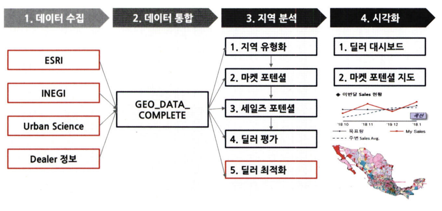

# 통계학 3주차 정규과제

📌통계학 정규과제는 매주 정해진 분량의 『*데이터 분석가가 반드시 알아야 할 모든 것*』 을 읽고 학습하는 것입니다. 이번 주는 아래의 **Statistics_3rd_TIL**에 나열된 분량을 읽고 `학습 목표`에 맞게 공부하시면 됩니다.

아래의 문제를 풀어보며 학습 내용을 점검하세요. 문제를 해결하는 과정에서 개념을 스스로 정리하고, 필요한 경우 추가자료와 교재를 다시 참고하여 보완하는 것이 좋습니다.

2주차는 `2부-데이터 분석 준비하기`를 읽고 새롭게 배운 내용을 정리해주시면 됩니다.


## Statistics_3rd_TIL

### 2부. 데이터 분석 준비하기
### 08. 분석 프로젝트 준비 및 기획
### 09. 분석 환경 세팅하기


## Study Schedule

|주차 | 공부 범위     | 완료 여부 |
|----|----------------|----------|
|1주차| 1부 p.2~56     | ✅      |
|2주차| 1부 p.57~79    | ✅      | 
|3주차| 2부 p.82~120   | ✅      | 
|4주차| 2부 p.121~202  | 🍽️      | 
|5주차| 2부 p.203~254  | 🍽️      | 
|6주차| 3부 p.300~356  | 🍽️      | 
|7주차| 3부 p.357~615  | 🍽️      |  

<!-- 여기까진 그대로 둬 주세요-->

# 08. 분석 프로젝트 준비 및 기획

```
✅ 학습 목표 :
* 데이터 분석 프로세스를 설명할 수 있다.
* 비즈니스 문제를 정의할 때 주의할 점을 설명할 수 있다.
* 외부 데이터를 수집하는 방법에 대해 인식한다.
```
<!-- 새롭게 배운 내용을 자유롭게 정리해주세요.-->
## 데이터 분석의 전체 프로세스
##### 데이터 분석의 3단계
데이터 분석의 궁극적 목표: 의사결정 프로세스 최적화
데이터 분석 통계 개발과 함께 데이터 마트 설계/구축 등 통합 연계 필요


1. 설계 단계
프로젝트 목표를 명확히 정하고 팀을 구성함.
실무자(데이터 담당자)와 분석자 간 협업 체계를 마련해야 하며,
정기적인 미팅을 통해 상황을 공유하는 것이 중요함.

2. 분석 및 모델링 단계
데이터 분석을 위한 환경을 구성하고 본격적인 데이터 추출, 가공, 모델링을 수행.
비즈니스 적합성과 성능 평가가 중요하며,
CRISP-DM, SEMMA 등 분석 절차 모델을 활용하면 분석을 체계적으로 진행 가능.

3. 구축 및 활용 단계
모델을 실무에 적용하고 성과를 측정함.
IT 시스템 구축과 부서 간 협의가 필요하며,
적용 후에는 A/B 테스트 등을 통해 성과를 비교하고 개선 효과를 측정함.

## CRISP - DM 방법론


1단계 – 비즈니스 이해 (Business Understanding)
현재 상황 평가: 비즈니스 문제와 환경을 파악함.
데이터 마이닝 목표 결정: 분석을 통해 달성할 목표를 설정.
프로젝트 계획 수립: 전반적인 프로젝트 방향과 일정 수립.

2단계 – 데이터 이해 (Data Understanding)
데이터 설명: 사용될 데이터의 구조와 특성 파악.
데이터 탐색: 데이터 분포, 패턴, 이상치 등 탐색.
데이터 품질 확인: 결측치, 오류 등 데이터의 신뢰도 점검.

3단계 – 데이터 준비 (Data Preparation)
데이터 선택: 분석에 필요한 변수와 데이터 선택.
데이터 정제: 이상치 제거, 결측치 처리 등 데이터 클렌징.
필수 데이터 구성: 분석 목적에 맞는 형태로 재구성.
데이터 통합: 여러 소스의 데이터를 하나로 결합.

4단계 – 모델링 (Modelling)
모델링 기법 선정: 문제 유형에 맞는 분석 기법 선택.
테스트 디자인 생성: 모델 검증을 위한 테스트 설계.
모델생성, 모델평가

5단계 – 평가 (Evaluation)
결과 평가: 모델이 비즈니스 목표에 부합하는지 평가함.
프로세스 검토: 분석 과정이 적절했는지 전반적으로 점검.
다음 단계 결정: 모델 개선, 적용 또는 프로젝트 종료 여부 결정.

6단계 – 배포 (Deployment)
배포 계획: 분석 결과를 실제 환경에 적용하기 위한 계획 수립.
모니터링 및 유지 관리 계획: 결과의 지속적인 성능 관찰과 개선 준비.
최종 보고서 작성: 프로젝트 결과와 과정을 문서화.
프로젝트 검토: 전체 프로젝트를 되돌아보고 개선점 도출.

## SAS SEMMA 방법론


Sampling 단계
▪ 전체 데이터에서 분석용 데이터 추출
▪ 의미 있는 정보를 추출하기 위한 데이터 분할 및 병합
▪ 표본추출을 통해 대표성을 가진 분석용 데이터 생성
▪ 분석 모델 생성을 위한 학습, 검증, 테스트 데이터셋 분할

Exploration 단계
▪ 통계치 확인, 그래프 생성 등을 통해 데이터 탐색
▪ 상관분석, 클러스터링 등을 통해 변수 간의 관계 파악
▪ 분석 모델에 적합한 변수 선정
▪ 데이터 현황을 파악하여 비즈니스 아이디어 도출 및 분석 방향 수정

Modification 단계
▪ 결측값 처리 및 최종 분석 변수 선정
▪ 로그변환, 구간화(Binning) 등 데이터 가공
▪ 주성분분석(PCA) 등을 통해 새로운 변수 생성

Modeling 단계
▪ 다양한 데이터마이닝 기법 적용에 대한 적합성 검토
▪ 비즈니스 목적에 맞는 분석 모델을 선정하여 분석 알고리즘 적용
▪ 지도학습, 비지도학습, 강화학습 등 데이터 형태에 따라 알맞은 모델 선정
▪ 분석 환경 인프라 성능과 모델 정확도를 고려한 모델 세부 옵션 설정

Assessment 단계
▪ 구축한 모델들의 예측력 등 성능을 비교, 분석, 평가
▪ 비즈니스 상황에 맞는 적정 임계치(Cut off) 설정
▪ 분석 모델 결과를 비즈니스 인사이트에 적용
▪ 상황에 따라 추가적인 데이터 분석 수행


초반부: 비즈니스 문제/해결방향 정의 및 데이터 탐색
중반부: 데이터 목적에 맞게끔 수집, 가공 및 머싱러닝 모델 사용
후반부: 데이터 분석 결과 검토, 검증. 실제환경 적용

## 비즈니스 문제 정의와 분석 목적 도출
현재 문제 정의 명확하게 한 후 데이터 분석 목적 설정해야 함.
목적설정이 가장 중요!
공급사슬 (SCM)에서 수요 변동의 단계적 증폭 현상을 채찍 효과라 한다.
데이터 분석 프로젝트에서돋 채찍 효과가 발생 가능
비즈니스 이해 및 문제 정의가 조금이라도 잘못되면 
최종 인사이트 도출 및 솔루션 적용 단계에서 효과 보기 어려움


비즈니스 올바르게 정의하는 논리적 접근법: MECE
세부 정의들이 서로 겹치지 않고 전체 합치면 완전히 전체를 이루는 것
로직트리 활용해 세부항목 정리


데이터 분석을 하려면 명확한 문제 정의와 분석 목적이 먼저 필요함
아무리 데이터가 많아도 목표가 없으면 분석이 제대로 진행되지 않음
분석을 위한 변수 설정과 데이터 수집 계획도 초기 단계에서 마련되어야 함.
이 과정은 프로젝트 시간의 절반 이상을 차지할 수 있음.

문제 정의가 불분명하면 프로젝트 중반에 가서도 방향이 정해지지 않고 데이터 가공만 하다 끝날 수 있음.
결국 인사이트 없이 프로젝트가 종료될 가능성이 높아짐.
문제와 목적은 처음부터 명확하게 정리되어야 함.

비즈니스 문제는 현상을 직접적으로 설명하는 문장으로 표현해야 함. 
예를 들어, “약정이 끝난 고객이 이탈하여 수익이 감소함”,
“재고 부족으로 배송이 지연됨”, “대출 고객이 상환하지 않아 은행이 손해를 봄”과 같이 정리함.

또한 문제의 원인과 배경까지 함께 설명해야 분석 방향이 분명해짐. 
그래야 분석 결과를 실질적인 인사이트로 연결할 수 있음. 
데이터 분석의 출발점은 정확한 문제 정의와 목적 설정임. 


페이오프 매트릭스: 문제해결 우선순위 결정 방식
과제 수익성 /실행 가능성 순위에 따라 우선순위 표현


## 분석 목적의 전환
데이터 분석 프로젝트는 명확한 문제 정의와 분석 목적 설정에서 시작되어야 함. 
하지만 프로젝트 초기에는 데이터 탐색 전이라 유의미한 인사이트를 확보하기 어려움. 
그래서 분석 목적을 설정하기 전, 
간단한 샘플 데이터를 활용한 PoC(Proof of Concept) 과정을 거치면 효과적임.

분석 프로젝트는 진행 중에도 언제든 방향이 바뀔 수 있음. 
따라서 유연한 사고가 필요하며, 
분석 목적이 변경되는 순간을 팀 전체와 실무자에게 빠르게 공유하는 것이 중요함. 
그렇지 않으면 프로젝트가 어느 정도 진행되었을 때에도 목표 불명확으로 인해 혼란이 생기고, 
최종 결과가 조직의 실무진이나 경영진에게 받아들여지지 않을 수 있음.

분석은 단순히 데이터를 해석하는 데 그치지 않고, 
변화하는 환경에 맞춰 문제 정의와 분석 목적도 유연하게 조정되어야 함. 
상황에 따라 분석 콘셉트가 “무엇을 하려 하는가?”에서
“이 데이터로 우리는 무엇을 할 수 있는가?”로 바뀌기도 함. 
이 자체는 자연스러운 변화로 받아들이고, 변화 시점을 명확히 공유하는 것이 핵심임.

예시
특수원사 생산 과정시 절사 발생.
제품 불량에 따른 손실로 공정중지 및 생산성 악화
그러나 필터 교체 이력과 공정 센싱 데이터 분석시 필터 교체와 절사 발생률 사이 관계 찾지x


문제점 공유, 해결방안 모색
절사와 관련된 요소 찾고 절사율 낮출 수 있돌고 프로젝트 목적 전환

분석 프로젝트시 실무자 간 커뮤니케이션 매우 중요.
실무자의 관심을 얻고 분석가들이 동질가므 신뢰감을 얻기 위함

## 도메인 지식
데이터 분석 역량을 위한 인력 충원 방법
1. 데이터 분석가 고용
2. 기본 실무자 교육하여 데이터 분석가로 만들기

도메인 지식: 해당되는 분야의 업에 대한 이해도
업종단위, 조직 단위 이해도 될 수 있음.

비즈니스 도메인 이해 -> 데이터 분석가 전문 역량 갖추는 것
예시: 배달 플랫폼 도메인
배달 앱의 국밥 키워드 노출 순위 최적화
선호하는 음식 - 지역에 따라 다름.

케글 우승자 -> 머신러닝 전문가, 분석 모델링 하는 사람들임
실제 업무와는 그러나 많은 간극 존재
케글은 해당 도메인 전문가가 미리 변수들을 정의/정리 후 정보를 제공해주기 때문
직접 의미 있는 변수를 찾아내고 분석 방향을 설정하는 것은 도메인 지식이 충분하게 수반시 가능

도메인 지식을 효과적으로 습득하는 법
비즈니스 도메인에 소속된 실무자와 미팅, 질문과 자료 요청
관련 논문들을 통해 지식 획득
현장 방문해 데이터 만들어지는 과정 보는 것

## 외부 데이터 수집과 크롤링
분석 목적 정의 및 외부 데이터 찾기
많은 시간, 비용, 노력이 소요되기 때문에 고민 검토 필요

정형, 반정형, 비정형 등 다양한 데이터 수집하는 것


외부 데이터 수집법
1. 데이터를 판매하는 전문 기업에게 구매. 고품질이나 비쌈
2. 오픈 데이터를 수집. 저렴하나 활용성 낮음.
3. 크롤링. 데이터 수집 위한 프로그래밍 필요.

robots.txt
User-agent
Allow
Disallow

크롤링은 스크래핑이라고도 불리며 웹상을 돌아다니며 정보 수집하는 것
직접 웹사이트 구조 파악도 간으, open API를 통해 정리된 데이터 제공받을 수 있음.

# 09. 분석 환경 세팅하기

```
✅ 학습 목표 :
* 데이터 분석의 전체적인 프로세스를 설명할 수 있다.
* 테이블 조인의 개념과 종류를 이해하고, 각 조인 방식의 차이를 구분하여 설명할 수 있다.
* ERD의 개념과 역할을 이해하고, 기본 구성 요소와 관계 유형을 설명할 수 있다.
```

<!-- 새롭게 배운 내용을 자유롭게 정리해주세요.-->
## 어떤 데이터 분석 언어를 사용하는 것이 좋을까?
SAS, SPSS, R, 파이썬 가장 많이 사용되고 있음.
IBM의 SPSS는 사회과학을 위해 개발된 통계 프로그램.

##### SAS
대표적 제품형 데이터 분석 솔루션
프로그래밍 언어보다는 솔루션에 가까움
GUI 기반의 데이터 마이닝 도구를 지원하기 때문에 스킬 부족한 사람도 가능.
고객 서비스 이점
대기업, 금융업계 기업들 다수 사용
그러나 SAS 점유율 지속적으로 감소중
최근에는 자유도 높고 비용 합리적인 R과 파이썬 언어 선호함.

##### R
오픈소스 데이터 분석용 언어
통계적 기능, 데이터 시각화 우수
활발한 커뮤니티를 활용해 문제, 궁금증 해결 가능
프로그래밍적 소양이 부족해도 괜찮음

##### 파이썬
무료로 다운받아 사용 가능.
C언어로 구현된 프로그래밍 언어
웹서비스 응용 프로그램 등 다양한 분야에서 사용됨
c와 차이점은 문법이 훨씬 쉽고 c언어보다 느리다는 점.
커뮤니티 활발, 그러나 구현 복잡하고 직관적이지 못함.


##### SQL
관계형 데이터베이스 시스템에서 데이터 관리, 처리를 위해 설계된 언어
명령문이 짧고 간결함

## 데이터 처리 프로세스 이해하기
OLTP -> DW -> DM -> OLAP


OLTP
실시간으로 데이터를 트랜젝션 단위로 수집, 분류, 저장하는 시스템
데이터가 생성되고 저장되는 처음단계

DW
데이터 창고. 수집된 데이터를 사용자 관점에서 주제별로 통합, 
원하는 데이터를 빼낼 수 있도록 저장해 놓은 통합 데이터베이스
비슷한 개념으로 ODS도 있음. 이는 임시로 데이터 저장하는 중간단계 저장소

DM
사용자 목적에 맞게 가공된 일부 데이터 저장소

ETL
추출, 변환, 불러내기를 말함.
저장된 데이터를 사용자가 요구하는 포멧으로 변형하여 이동시키는 작업 과정


## 분산 데이터 처리
하나의 컴퓨터가 아닌, 여러 대의 컴퓨터가 나눠서 데이터를 처리하고 그 결과를 합치는 방식
빅데이터 처리에서는 필수적인 개념

Scale-up: 한 컴퓨터의 성능(용량과 프로세서)을 높여 처리 속도를 올리는 방식.
→ 성능이 좋아도 하나의 컴퓨터만 처리해야 하므로 데이터가 많아질수록 속도가 급격히 저하됨.

Scale-out: 여러 컴퓨터를 병렬로 연결해 함께 작업을 수행하는 방식.
→ 연산을 분산하므로 처리 효율이 훨씬 높음.

##### HDFS
단순 병렬 연결만으로는 속도 향상에 한계가 있음.
→ 데이터를 효율적으로 나눠 처리하고, 결과를 통합하는 기술이 필요함.

대표적인 기술:

HDFS (Hadoop Distributed File System)
MapReduce

HDFS 구성 요소:
슬레이브 노드 (Slave node): 데이터 저장, 계산
마스터 노드 (Master node): 대량 데이터 저장, 맵리듀스 방식으로 데이터 병렬처리
클라이언트 머신 (Client machines): 맵리듀스 작업을 통해 산출된 결과 보여줌
→ 이 세 가지 모듈이 함께 작동하여 대용량 데이터를 빠르고 효율적으로 처리함.

##### 맵리듀스(MapReduce)
맵리듀스는 HDFS에 저장된 데이터를 효과적으로 처리하기 위한 방식으로, 구글에서 처음 고안한 후 오픈소스로 발전됨.
맵리듀스는 크게 두 단계, 맵(Map)과 리듀스(Reduce)로 구성됨.

Map 단계
역할: 데이터를 key-value 쌍으로 분리하고, 관련된 데이터끼리 임시 집합을 만듦.
예시:"자동차" → key: 자동차, value: car
"맥주" → key: 맥주, value: beer
→ 이처럼 각 데이터를 쌍으로 묶어 맵 레코드를 생성

 Reduce 단계
역할: Map 단계에서 생성된 key-value 쌍을 기준으로 정렬 및 병합하여 결과를 계산.
예시: word count 작업에서는 같은 단어들을 모아서 총 개수를 세는 결과를 도출.

맵리듀스 처리 단계 요약 (단계별 명칭)
Splitting (분할):
→ 입력 데이터를 고정된 크기의 조각으로 나눔
Mapping (매핑):
→ 데이터를 key-value 쌍으로 구성하여 단위별 계산 수행
Shuffling (셔플링):
→ 같은 key를 가진 데이터끼리 정렬하고 병합함
Reducing (리듀싱):
→ 셔플된 결과를 집계하여 최종 결과를 계산


##### 하둡
- 하둡 1.0
구성요소: HDFS + 맵리듀스
리소스 관리 시스템: JobTracker
역할:
클러스터 전체의 리소스를 관리
실행 중인 Job의 진행 상황과 에러를 관리
완료된 Job의 로그를 저장하고 확인
JobTracker가 리소스 관리와 잡 실행을 동시에 수행했기 때문에, 
확장성과 유연성에 한계가 있었음.

YARN (Yet Another Resource Negotiator)
하둡 2.0에서 도입된 리소스 관리 시스템
기존 JobTracker를 다음 3가지 역할로 나누어 기능을 고도화함:

Resource Manager (리소스 매니저)
→ 전체 리소스를 관리하고, 애플리케이션 실행을 스케줄링함.

Application Master (애플리케이션 마스터)
→ 각 애플리케이션 단위로 존재하며, 해당 Job의 실행을 관리함.

Timeline Server (타임라인 서버)
→ 잡 실행 이력, 로그 등의 메타데이터를 관리함.

추가 구성 요소 – Node Manager:
→ 각 노드에서 개별 Task를 실행하고 진행 상태를 모니터링하는 역할을 담당.

YARN을 통해 하둡 2.0은 리소스 관리와 실행 관리를 분리하여,
 동시에 여러 잡을 효율적으로 실행할 수 있게 되었음.


##### 분산 시스템 구조


## 아파치 스파크
아파치 스파크를 통해 데이터 분석 환경을 구축하는 기업 많아짐.
HDFS의 환경 봐야함.
스파크는 분산데이터 처리를 하는 하나의 시스템
맵리듀스 방식보다 10배 빠르고 인메모리 분석은 100배 빠름
맵리듀스 방식은 프로세스 관점의 데이터가 디스크에 남아있는 반면 
스파크는 메모리에 저장되어 재사용 가능


##### 스파크의 특징
인메모리 기반 빠른 데이터 처리 가능
파이썬, sql 등 다양한 언어 지원
데이터 마이닝 같은 온라인 분석 처리 작업에 특화 됐으나,
대량의 온라인 트랜잭션 처리와 같은 대량의 원자성 처리에는 적합 안함.

##### 제플린
제플린(Zeppelin) 노트북
웹 기반 시각화 도구로, 스파크 환경에서 데이터 분석 시 주로 사용됨.
사용자는 파이썬 코드만으로도 데이터 가공과 모델링을 수행할 수 있음.

PySpark & Spark SQL
PySpark: 스파크 전용 파이썬 API로 병렬 데이터 처리를 효율적으로 수행 가능.
Spark SQL: SQL 문법으로 스파크 환경에서 데이터를 다룰 수 있는 기능.

## 이블 조인과 정의서 그리고 ERD

데이터 분석에서의 테이블 활용
데이터 분석가는 여러 개의 테이블을 조합하여 데이터를 가공하고 인사이트를 도출함.
보통 3개 이상의 테이블을 사용하는 경우가 많으며, 하나의 테이블만으로 분석하는 경우는 드뭄.
따라서 각 테이블의 속성과 관계를 명확히 이해하고 있어야 함.
테이블 구조를 잘 모르면 조인(join) 과정에서 오류가 발생할 수 있으며, 잘못된 분석 결과를 초래할 수 있음.

##### 테이블 조인 (Join)
조인이란 두 개 이상의 테이블을 공통된 컬럼을 기준으로 결합하는 작업임.
주요 조인 방식:
이너 조인 (Inner Join)
아우터 조인 (Outer Join)
레프트 조인 (Left Join)
라이트 조인 (Right Join)
풀 조인 (Full Join)
크로스 조인 (Cross Join)
→ 다양한 조인 방식을 이해하고 적절히 사용하는 것이 정확한 데이터 결합과 분석의 핵심임.


##### 레프트 조인(Left Join)과 라이트 조인(Right Join)
개념 비교
레프트 조인 (Left Join):
왼쪽(기준) 테이블의 모든 데이터를 유지하며,
오른쪽 테이블과 매칭되는 값만 결합.
매칭되지 않는 값은 NULL로 표시됨.

라이트 조인 (Right Join):
오른쪽(기준) 테이블의 모든 데이터를 유지하고,
왼쪽 테이블과 매칭되는 값만 결합.

예시 설명
왼쪽 테이블: 직원 정보
오른쪽 테이블: 부서 정보
레프트 조인 시: 직원 정보는 모두 유지되며,
존재하지 않는 부서 코드는 지역명이 NULL로 표시됨.
만약 이너 조인을 했다면, 해당 직원 정보는 사라졌을 것임.

##### 이너 조인(Inner Join) vs 풀 조인(Full Join)
이너 조인 (Inner Join)
두 테이블 간 겹치는 부분만 결합해서 출력하는 방식.

공통된 키 값이 존재할 때만 행이 생성됨.

예: 직원 정보 테이블과 부서 정보 테이블을 이너 조인할 경우,
부서코드가 양쪽 모두에 있는 경우에만 해당 행이 유지됨.

매칭되지 않는 행은 사라짐.
→ 예: 부서 정보에 없는 부서코드를 가진 직원은 결과에서 제외됨.

풀 조인 (Full Join)
양쪽 테이블의 모든 행을 다 포함하는 조인 방식.
조인 조건이 맞지 않더라도 모든 행이 결과에 포함됨.
겹치지 않는 부분은 NULL 값으로 채워짐.

예: 부서 코드가 없는 직원도 사라지지 않고 결과에 포함되며,
해당 부서 정보는 NULL로 표시됨. 반대의 경우도 동일

##### 크로스 조인 (Cross Join)
개념
모든 가능한 조합을 생성하는 조인 방식
기준 없이 두 테이블의 모든 행을 서로 곱집합 형태로 결합함
결과 테이블의 행 수 = 왼쪽 테이블 행 수 × 오른쪽 테이블 행 수

## 데이터 단어사전
정의
데이터 단어사전(Data Dictionary)이란,
각 컬럼명과 테이블명에 이름을 붙일 때 사용하는 체계적이고 약속된 규칙을 의미함.
즉, 데이터베이스에서 컬럼/테이블의 의미를 명확히 하기 위한 사전적 정의 체계임.

필요성
테이블과 컬럼은 일반적으로 영문 약어로 표기됨.
영어 단어를 그대로 사용하면 길어지고, 축약하면 가독성과 의미 전달이 어려움.
이 때문에 일관된 명명 규칙을 가진 단어사전이 필요함.


메타데이터 관리 시스템은 데이터가 어디에 저장되어 있는지, 데이터 정보 관리 시스템

## 테이블 정의서
정의
테이블 정의서는 메타데이터 관리 시스템의 간소화 버전으로,
테이블의 구조를 정형화된 표 형식으로 정리한 문서임.

포함 내용
각 테이블 및 컬럼의
한글명과 영문명
데이터 속성
간단한 설명 등을 포함
주로 DW(Data Warehouse), DM(Data Mart) 환경에서 사용됨

활용 목적
엑셀 파일 형태로 제공되어,
사용자가 원하는 테이블이나 컬럼을 빠르게 검색하고 이해할 수 있도록 도와줌
예: "쿠폰 발급 정보"를 찾고 싶을 때, 키워드 검색으로 관련 테이블 파악 가능

주의 사항
테이블 정의서는 테이블 간 관계 정보(릴레이션)를 담고 있지 않음
따라서 DB 구조에 익숙한 사람에게는 유용하지만,
초보자나 전체 관계를 보고 싶은 사람에게는 이해에 한계가 있을 수 있음
ERD(Entity Relationship Diagram)를 함께 참고하면
테이블 간 관계 구조까지 파악 가능하여
데이터 환경을 더 잘 이해할 수 있음


## ERD (Entity Relationship Diagram)
RD란?
Entity Relationship Diagram(ERD)는
데이터베이스의 테이블 구성 정보와 테이블 간 관계를 도식으로 표현한 그림 형태의 모델임.
테이블(엔터티)의 구조와 연결 키를 직관적으로 이해할 수 있게 도와줌.
ERD 확인은 데이터 분석가나 과학자가 새로운 프로젝트에 투입될 때 필수적인 작업임.

ERD의 분류
물리 ERD (Physical ERD):
DB의 실제 구현 형태를 기준으로 작성. 일반적으로 영문으로 표기.

논리 ERD (Logical ERD):
사용자 입장에서 테이블 간 매핑 오류 없이 데이터 구조를 파악할 수 있게 정리. 주로 한글로 작성됨.

ERD의 핵심 개념: 키 (Key)
기본 키 (Primary Key)
→ 테이블 내에서 각 행을 유일하게 식별하는 컬럼

외래 키 (Foreign Key)
→ 다른 테이블과 연결되도록 참조하는 키.
→ 외래 키가 있는 테이블: 자식 테이블
→ 외래 키를 참조당하는 테이블: 부모 테이블

그 외 용어
후보 키(Candidate Key): 유일성 있는 후보 키 중 선택되지 않은 것
슈퍼 키(Super Key): 유일성과 최소성을 만족하는 하나 이상의 키 조합

ERD의 활용 목적
테이블 간 참조 관계나 데이터 흐름 구조를 한눈에 파악 가능
DB에 익숙하지 않더라도 ERD를 보면 데이터 구조를 이해하고 가공할 수 있음
데이터 분석가는 ERD, 정의서, 메타데이터 시스템 등을 자유롭게 해석하고 활용할 수 있어야 함


<br>
<br>

# 확인 문제

## 문제 1.

> **🧚 아래의 테이블을 조인한 결과를 출력하였습니다. 어떤 조인 방식을 사용했는지 맞춰보세요.**

> 사용한 테이블은 다음과 같습니다.

|
---|---|

> 보기: INNER, LEFT, RIGHT 조인

<!-- 테이블 조인의 종류를 이해하였는지 확인하기 위한 문제입니다. 각 테이블이 어떤 조인 방식을 이용하였을지 고민해보고 각 테이블 아래에 답을 작성해주세요.-->

### 1-1. 

```
여기에 답을 작성해주세요!
```
LEFT조인
### 1-2. 

```
여기에 답을 작성해주세요!
```
INNER JOIN 
### 1-3. 

```
여기에 답을 작성해주세요!
```
RIGHT JOIN
### 🎉 수고하셨습니다.
