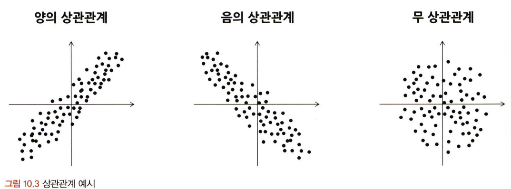
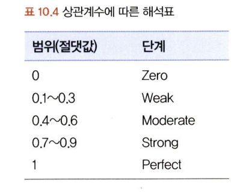
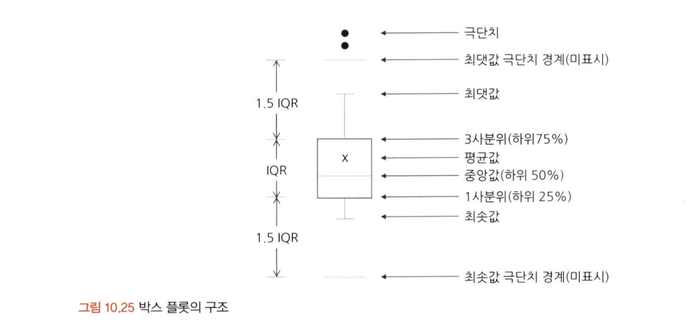

# 통계학 4주차 정규과제

📌통계학 정규과제는 매주 정해진 분량의 『*데이터 분석가가 반드시 알아야 할 모든 것*』 을 읽고 학습하는 것입니다. 이번 주는 아래의 **Statistics_4th_TIL**에 나열된 분량을 읽고 `학습 목표`에 맞게 공부하시면 됩니다.

아래의 문제를 풀어보며 학습 내용을 점검하세요. 문제를 해결하는 과정에서 개념을 스스로 정리하고, 필요한 경우 추가자료와 교재를 다시 참고하여 보완하는 것이 좋습니다.

4주차는 `2부. 데이터 분석 준비하기`를 읽고 새롭게 배운 내용을 정리해주시면 됩니다.


## Statistics_4th_TIL

### 2부. 데이터 분석 준비하기
### 10. 데이터 탐색과 시각화

## Study Schedule

|주차 | 공부 범위     | 완료 여부 |
|----|----------------|----------|
|1주차| 1부 p.2~56     | ✅      |
|2주차| 1부 p.57~79    | ✅      | 
|3주차| 2부 p.82~120   | ✅      | 
|4주차| 2부 p.121~202  | ✅      | 
|5주차| 2부 p.203~254  | 🍽️      | 
|6주차| 3부 p.300~356  | 🍽️      | 
|7주차| 3부 p.357~615  | 🍽️      | 

<!-- 여기까진 그대로 둬 주세요-->

# 10. 데이터 탐색과 시각화

```
✅ 학습 목표 :
* EDA의 목적을 설명할 수 있다.
* 주어진 데이터셋에서 이상치, 누락값, 분포 등을 식별하고 EDA 결과를 바탕으로 데이터셋의 특징을 해석할 수 있다.
* 공분산과 상관계수를 활용하여 두 변수 간의 관계를 해석할 수 있다.
* 적절한 시각화 기법을 선택하여 데이터의 특성을 효과적으로 전달할 수 있다.
```
<!-- 새롭게 배운 내용을 자유롭게 정리해주세요.-->
탐색적 데이터 분석, 상관성 분석, 시각화 기법
데이터 전처리 단계 -> 데이터 분석 프로세스에서 가장 많은 시간과 노력이 소모됨
ML 모델의 성능에는 알고리즘의 우수성, 파라미터 최적화보다 데이터 파악, 가공이 중요
상호작용하며 양방향으로 이루어짐.


GIGO (garbage In, Garbage Out) 
가치가 없는 데이터를 사용하면 무가치한 결과가 나온다는 뜻
원천 데이터는 오류, 이상치 많음. -> 다양한 각도에서 데이터 탐색, 시각화 해야 함.

#### EDA와 데이터 시각화의 차이
EDA 단계에서 데이터 파악을 위해 시각화 하기도 하지만
데이터 시각화의 궁극적 목적은 분석결과 커뮤니케이션임

시간시각화: 시간의 흐름에 따른 변화
비교시각화: 그룹별 차이
분포시각화: 특정항목이 차지하는 비중
관계 시각화: 서로 간의 관계
공간시각화: 실제 지리적 위치에 수치 나타내기

## 10.1 탐색적 데이터 분석

가공하지 않은 원천의 데이터를 있는 그대로 탐색하고 분석하는 기법
EDA 할 때는 극단적인 해석 피해야 하며 추론이나 자의적 해석도 지양해양 함.

#### EDA를 하는 주요 목적

데이터 형태, 척도가 분석에 알맞게 되어있는지 확인
데이터의 평균, 분산, 분포, 패턴 등의 확인을 통해 데이터 특성 파악
데이터의 결측값이나 이상치 파악 및 보완
변수 간의 관계성 파악
분석 목적과 방향성 점검 및 보정

### 10.1.1 엑셀을 활용한 EDA

데이터셋 직접 살펴보면 고객 성비 등등 대략적으로 파악 가능
데이터 이슈들은 미팅, 리스트업 통해 해결 가능함.
엑셀로 피벗테이블 생성 후 직관적 확인 및 데이터 파악 가능.
파이썬,R,SAS 등의 데이터 가공 및 시각화 기능이 아무리 좋아도 적은 데이터 다룰 때는 엑셀만큼 사용자 친화적이고 효율적 프로그램이 없다.

### 10.1.2 탐색적 데이터 분석 실습

- 탐색적 데이터 분석 전 패키지 임포트
CSV 파일 불러오기부터 데이터 전처리 가능한 pandas, 시각화 패키지 seaborn, matplotlib 임포트하기

- 데이터 불러오기 및 확인
파일 저장 경로 지정후 판다스 데이터 프레임으로 불러옴
헤드 메서드로 데이터가 제대로 로드됐는지 확인
명목형, 숫자형 값 확인

- 칼럼 속성 확인
info() 함수는 데이터에 대한 전반적 정보 나타냄.
데이터 구성 행/열 크기와 칼럼 구성 값 자료형 등을 확인 가능
숫자형, 문자형, 결측값 확인

- 칼럼 통계치 확인
숫자형 변수들은 기술통계적 측정 필요
describe() 평균, 표준편차, 최대 최솟값 등을 한번에 확인할 수 있는 유용한 함수
그러나 숫자형이지만 문자형 다름없는 칼럼 의미 없으므로 항목 빈도 확인 필수

- 칼럼 왜도 확인
왜도와 첨도 확인하기
변숫값 분포, 정규성 필요한 경우 로그변환, 정규화, 표준화 필요

- 칼럼 첨도 확인
왜도는 skew() 첨도는 kurtosis() 함수로 확인 가능
첨도는 투숙한 그룹 유아 명 babies 칼럼과 같이 분포 넓지 않으면 값 높게 나옴

- 그룹 구분에 따른 특정 변수 분포 차이 시각화
시각화 다양하게 가능.
다양한 옵션 사용하면 데이터 형태 더욱 잘 이해 가능

## 10.2 공분산과 상관성 분석

타깃변수 Y와 입력변수 X와의 관계는 물론 입력변수 X간의 관계도 살펴봐야 한다.
독립변수 변화에 따른 종속변수 변화량을 크게 하여 다중공선성 방지 가능
데이터 이해도 높일 수 있음.
상관분석: 데이터가 등간, 비율 척도, 두 변수가 선형적 관계라는 기본 가정


### 공분산
공분산과 상관계수는 각 변수 변동이 얼마나 닮았는지 표현함.
계산방식은 차이 있음.
공분산: 서로 공유하는 분산, 두 분산의 관계
값이 0이면 변수간 상관관계 없음. 양수면 양의 상관관계, 음수면 음의 상관관계

양의 상관관계: x1이 커지면 x2도 커진다.
음의 상관관계:  x1이 커지면 x2는 작아진다.

공분산 구하는 데이터 행렬 구조


공식 표현


### 상관계수
공분산 ->각 변수 간의 다른 척도 기준이 그대로 반영되어 공분산 값이 지니는 크기가 상관성의 정도를 나타내지 못한다.

이러한 단점 위해 서용하는 것이 정규화, 피어슨 상관계수

피어슨 상관계수 공식


상관계수 해석표



결정계수는 R^2
회귀분석 정확도 가늠하는 중요한 기준 값이 됨.
상관분석 실시시 매트릭스 구조의 상관분석 표나 히트맵 출력
중복 상관관계도 나옴. 상관계수와 유의확률 함께표시됨.

피어슨 상관계수 -> 등간, 비율척도의 데이터에 사용함.

이외 다른 상관분석 방법


### 공분산과 상관성 분석 실습
산점도 간 상관성 파악 가능
공분산으로는 변수간 상관성 분석하기에 가독성 떨어짐
corr() 함수 실행시 상관분석 결과 확인 가능
히트맵 확인, 중복 없애기도 진행함.

## 시간 시각화

시점 요소가 있는 데이터는 시계열 형태로 표현 가능
시간 흐름에 따른 데이터 변화 표현하기
전체 흐름 한눈에 확인, 트렌드 노이즈 찾기 쉬움
시간 시각화는 선그래프 형태인 연속형, 막대그래프 분절형으로 구분 가능

연속형 시간 시각화로 흔히 볼 수 있는 선그래프는 시간 간격의 밀도가 높을 때 사용한
데이터의 양이 너무 많거나 변동이 심하면 트렌드나 패턴을 확인하는 것이 어려울
수 있음 -> 이 경우 추세선 사용하기

추세선을 그리는 가장 일반적인 방법은 이동평균(Moving average) 방법을 사용하는 것이다. 데이터의 연속적 그룹의 평균을 구하는 것임.

선 그래프와 이동평균선 예시


분절형 시간 시각화 -> 시간 밀도 낮은 경우
상대적 차이 나타내는 것 유리
막대 색상 표현해 특정 시점 정보 추가 가능

누적막대그래프는 한 시점에 2개 이상 세부항목 존재시 사용

#### 시간 시각화 실습
패키지 임포트, 데이터 가공, 연도구분 칼럼 생성, 매출액 합계 함수 사용

## 비교 시각화
비교 시각화는 데이터가 간단하면 (누적)막대그래프만으로도 충분히 표현가능
하지만 그룹별 요소가 많아지게 되면 보다 효율적인 표현 기법을 사용해야 함
히트맵차트(Heatmap chart)그룹과 비교 요소가 많을 때 효과적으로 시각화를 할 수 있는 방법

각 그룹이 어떤 요소에서 높은 혹은 낮은 값을 가지는지 쉽게 파악할 수 있고 요소 간의 관계 파악 가능.

하나의 변수(그룹) × 하나의 변수(그룹/수준) × 하나의 변수(수준)
히트맵 예시


히트맵 차트는 그리는 것이 까다로움.

비교시각화 방법 -> 방사형 차트


평행 좌표 그래프 효과적 표현을 위해 변수별 값 정규화하기. 
차이 부각시킬 수 있음.


## 10.5 분포 시각화
연속형과 같은 양적 척도인지, 명목형과 같은 질적 척도인지에 따라 구분해 그림.
양적 척도의 경우 막대그래프나 선그래프로 분포를 나타낼 수도 있고, 히스토그램(histogram)을 통해분포를 단순화하여 보다 알아보기 쉽게 만들 수도 있음.

구간이 너무 많으면 보기가 어렵고 너무 적으면 정보의 손실이 크기 때문에 시각화의 이점이 사라짐.

질적 척도로 이루어진 변수는 구성이 단순한 경우 파이차트나 도넛차트를 사용

구성 요소가 복잡한 질적 척도를 표현할 때는 트리맵 차트를 이용하면 보다 효과적으로 표현가능.

와플 차트는 와플처럼 일정한 네모난 조각들로 분포를 표현한다. 하지만 트리맵 차트처럼 위계구조를 표현하지는 못함.

#### 분포 시각화 실습
데이터를 판다스 데이터 프레임으로 불러온 다음 확인
전체 샘플들의 신장을 히스토그램으로 시각화
이후 파이차트 위해 데이터 전처리
트리맵, 와플차트 시각화

## 10.6 관계 시각화
두 개의 연속형 변수 간의 관계를 나타낼 수 있는 산점도(scatter plot)
산점도를 그릴 때는 극단치를 제거하고서 그리는 것이 좋음.
극단치로 인해 주요 분포 구간이 압축되어 시각화의 효율이 떨어지기 때문임
각각의 점에 투명도를 주어 점들의 밀도를 함께 표현가능

산점도는 두 개의 변수 간 관계만 표현할 수 있다는 단점이 있다. 버블 차트를 이용하면 세 가지 요소의 상관관계를 표현할 수 있음.
버블차트를 해석할 때는 원의 지름이 아닌 면적을 통해 크기를 판단하도록 주의해야함. 지름이 두 배가 크면 실제 크기는 네 배가 큰 것이기 때문임.

#### 관계 시각화 실습
데이터 불러오기 및 확인
기본 산점도 시각화
산점도 회귀선 시각화
버블차트 시각화


## 10.7 공간 시각화
일반적인 집계 데이터나 그래프보다 지도 위에 표현하면 데이터를 훨씬 명확하고 직관적으로 볼 수 있음.
공간시각화는 위치 정보인 위도와 경도 데이터를 지도에 매핑하여 시각적으로 표현

지도를 확대하거나 위치를 옮기는 등 인터랙티브 한 활용이 가능함.
거시적에서 미시적으로 진행되는 분석 방향과 같이 스토리라인을 잡고 
시각화를 적용하는 것이 좋음


도트맵(Dot map)은 지리적 위치에 동일한 크기의 작은 점을 찍어서 해당 지역의 데이터 분포나 패턴을 표현하는 기법

버블맵(Bubble map)은 버블차트를 지도에 그대로 옮겨 둔 것

코로플레스맵(Choropleth map)은 단계 구분도라고도 하는데, 데이터 값의 크기에 따라 색상의 음영을 달리하여 해당 지역에 대한 값을 시각화하는 기법

커넥션맵(Connection map) 혹은 링크맵(Link map)은 지도에 찍힌 점들을 곡선 또는 직선으로 연결하여 지리적 관계를 표현

시작점과 도착점이 함께 표현되는 플로우맵(Flow map), 각 지역의 면적을 데이터 값에 비례하도록 변형시켜 시각화하는 카토그램(Cartogram) 등의 공간 시각화 방법이 존재.

#### 공간 시각화 실습
패키지 불러오기
스타벅스 지점 시각화
기본 지도 가져오기, 시각화
군집 마커 시각화
도트맵 시각화

## 박스 플롯
상자수염그림(Box-and-Whisker Plot)으로도 불리는 박스 플롯은 네모 상자 모양에 최댓값과 최솟값을 나타내는 선이 결합된 모양의 데이터 시각화 방법

박스 플롯은 하나의 그림으로 양적 척도 데이터의 분포 및 편향성, 평균과 중앙값 등 다
양한 수치를 보기 쉽게 정리해 줌.

특히 두 변수의 값을 비교할 때 효과적이기 때문에 알아 두면 많은 도움이 됨.



<br>
<br>

# 확인 문제

## 문제 1.
> **🧚 공분산과 상관계수의 차이점에 대해 간단히 설명하세요.**

```
여기에 답을 작성해주세요!
둘다 두 변수 간의 관계를 나타내지만, 차이가 있다.

공분산은 두 변수의 변화 방향을 나타낸다. 값이 양수면 x가 증가시 y도 증가하며 음수면 두 변수는 반대방향으로 움식인다. 그러나 두 변수의 곱 단위이기 때문에 절대적 크기 비교는 어렵다.

상관계수는 이러한 공분산의 단점을 보완하기 위해 공분산을 두 변수의 표준편차로 나눈 값이다. 
항상 -1~1사이의 값을 가지며
1에 가까울수록 강한 양의 상관, -1에 가까울수록 강한 음의 상관, 0이면 선형관계가 없다. 

상관계수는 크기와 방향을 모두 표준화하여 제공하여 해석, 비교가 쉽다.
```

## 문제 2.
> **🧚 다음 데이터 분석 목표에 적합한 시각화 방법을 보기에서 모두 골라 연결해주세요.**

> 보기: 산점도, 선그래프, 막대그래프, 히스토그램, 박스플롯

(a) 변수의 분포 확인   
(b) 두 변수 간의 관계 확인   
(c) 집단별 평균 비교   
(d) 시계열 데이터 분석

<!--중복 가능-->

```
여기에 답을 작성해주세요!
(a) 변수의 분포 확인 : 히스토그램, 박스플롯
(b) 두 변수 간의 관계 확인 : 산점도
(c) 집단별 평균 비교 : 막대그래프, 박스플롯
(d) 시계열 데이터 분석 : 선그래프
```
### 🎉 수고하셨습니다.