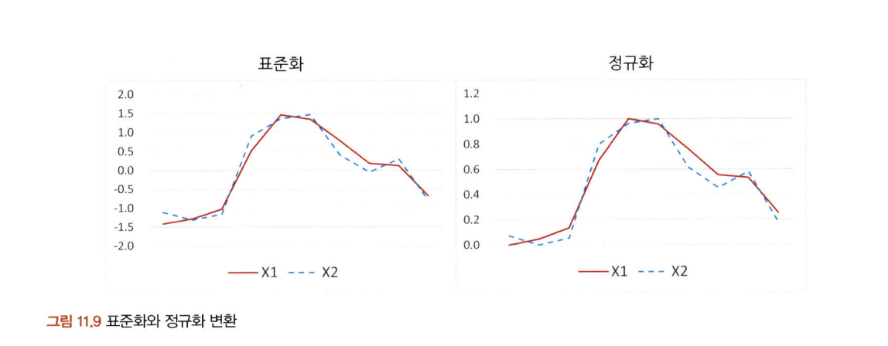
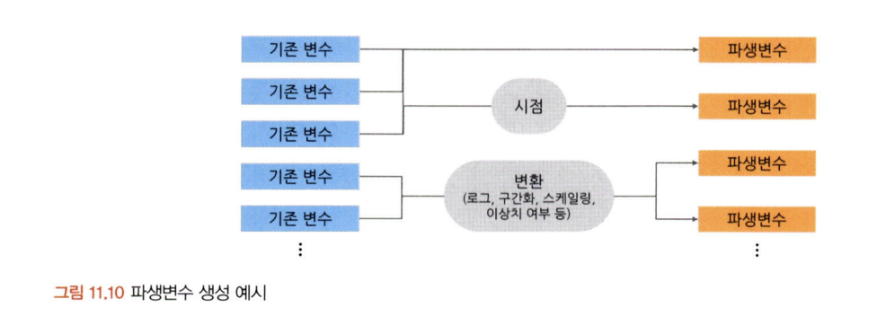

# 통계학 5주차 정규과제

📌통계학 정규과제는 매주 정해진 분량의 『*데이터 분석가가 반드시 알아야 할 모든 것*』 을 읽고 학습하는 것입니다. 이번 주는 아래의 **Statistics_5th_TIL**에 나열된 분량을 읽고 `학습 목표`에 맞게 공부하시면 됩니다.

아래의 문제를 풀어보며 학습 내용을 점검하세요. 문제를 해결하는 과정에서 개념을 스스로 정리하고, 필요한 경우 추가자료와 교재를 다시 참고하여 보완하는 것이 좋습니다.

5주차는 `2부. 데이터 분석 준비하기`를 읽고 새롭게 배운 내용을 정리해주시면 됩니다.


## Statistics_5th_TIL

### 2부. 데이터 분석 준비하기
### 11.데이터 전처리와 파생변수 생성


## Study Schedule

|주차 | 공부 범위     | 완료 여부 |
|----|----------------|----------|
|1주차| 1부 p.2~56     | ✅      |
|2주차| 1부 p.57~79    | ✅      | 
|3주차| 2부 p.82~120   | ✅      | 
|4주차| 2부 p.121~202  | ✅      | 
|5주차| 2부 p.203~254  | ✅      | 
|6주차| 3부 p.300~356  | 🍽️      | 
|7주차| 3부 p.357~615  | 🍽️      | 

<!-- 여기까진 그대로 둬 주세요-->

# 11.데이터 전처리와 파생변수 생성

```
✅ 학습 목표 :
* 결측값과 이상치를 식별하고 적절한 방법으로 처리할 수 있다.
* 데이터 변환과 가공 기법을 학습하고 활용할 수 있다.
* 모델 성능 향상을 위한 파생 변수를 생성하고 활용할 수 있다.
```

## 11.1. 결측값 처리
<!-- 새롭게 배운 내용을 자유롭게 정리해주세요. -->
대부분의 로우 데이터는 결함을 가지고 있음.
결측값 처리 방법 결정 전 데이터 탐색을 통해 결측값의 비율과, 결측값 몰려있지 않은지 파악 필요
빈 문자열도 확인 필요함.

결측값은 분석 환경에 따라 ‘.’. ‘NA', 'NaN' 등으로 표시됨

#### 결측치 발생특성에 따른 결측값 종류
완전 무작위 결측(MCAR: Missing Completely at Random)은 이름 그대로 순수하게 결측값이 무작위로 발생한 경우임.

무작위 결측(MAR: Missing at Random)은 다른 변수의 특성에 의해 해당 변수의 결측치가 체계적으로 발생한 경우임.

비무작위 결측(NMAR: Missing at Not Random)은 결측값들이 해당 변수 자체의 특성을 갖고 있는 경우임.

가장 간단한 결측값 처리 방법은 결측값이 심하게 많은 변수를 제거하거나 결측값이 포함된 행
(observations)을 제외하고 데이터 분석을 하는 표본 제거 방법(Completes analysis)을 사용하는
것임.

#### 결측값 처리 방법
- 표본 제거 방법(Completes analysis): 가장 간단한 결측값 처리 방법으로, 결측값이 심하게 많은 변수를 제거하거나 결측값이 포함된 행(observations)을 제외하고 데이터 분석을 함.

- 평균 대치법(Mean Imputation): 결측값을 제외한 온전한 값들의 평균을 구한 다음, 그 평균 값을 결측값들에 대치하는 것.

- 보간법(interpolation): 데이터가 시계열적 특성을 가지고 있을 때 효과적임


- 회귀대치법(regression imputation): 해당 변수와 다른 변수 사이의 관계성을 고려하여 결
측값을 계산하여 보다 합리적으로 결측값을 처리함. 추정하고자 하는 결측값을 가진 변수를 종속변수로 하고, 나머지 변수를 독립변수로 하여 추정한 회귀식을 통해 결측값을 대치하는 것임.  결측된 변수의 분산을 과소 추정하는 문제가 존재함.

이러한 문제 해결 위해 사용하는 것은

- 확률적 회귀대치법(stochastic regression imputation): 인위적으로 회귀식에 확률 오차항을 추가하여 변동성을 조정함.

#### 단순 대치법 표본오차 과소 추정 문제 해결 위한 방법
다중 대치법(multiple imputation): 가장 많이 사용되는 방법, 단순대치를 여러 번 수행하여 n 개의 가상적 데이터를 생성하여 이들의 평균으로 결측값을 대치하는 방법


대치 단계에서는 일반적으로 몬테카를로(MCMC: Markov Chain Monte Carlo)¹ 방법이나 연쇄방정
식을 통한 다중 대치(MICE: Multivariate Imputation by Chained Equation)를 사용하여 대치값 임의 생성
(결측값의 비율이 증가할수록 가상데이터도 많이 생성해야 검정력이 증가)
평균공식을 통해 각각 데이터셋의 상이한 추정치와 표준오차를 결합하여 결측치가 채워진 최종 데이터셋을 만들면 다중 대치법의 모든 단계가 완료됨.

### 결측값 처리 실습
패키지 설치 및 임포트
데이터 불러오기 및 확인
각 칼럼의 속성 및 결측값 확인
각 칼럼의 결측값 수 산출
각 칼럼의 결측값 시각화
빈 문자열 포함 여부 확인
결측값 표본 제거
측정값, 평균값, 중앙값, 최빈값 등 대치
보간법 적용 대치
다중 대치법 적용

## 11.2. 이상치 처리
<!-- 새롭게 배운 내용을 자유롭게 정리해주세요. -->
이상치(outlier): 일부 관측치의 값이 전체 데이터의 범위에서 크게 벗어난 아주 작거나 큰 극단적인 값을 갖는 것

정확도 감소시키기 때문에 제거해야 함. 그러나 전체 데이터의 양이 많을수록 튀는 값이 통곗값에 미치는 영향력이 줄어들어 이상치 제거의 필요성이 낮아짐.

이상치  존재하면 이상치 제거 후 분석 모델링에 들어가야 함.


오른쪽 그래프에서는 좌측 상단에 이상치 하나가 포함됨으로 인해 회귀선의 경사가 왜곡됨. 
이처럼 극단적인 값은 데이터 분석 모델의 예측력을 약화시키는 주요 원인이 됨.

이상치는 해당 값을 결측값으로 대체한 다음 결측값 처리를 하거나, 아예 해당 이상치를 제거
(trimming)하는 것이 가장 간단함.

하지만 그렇게 하면 추정치의 분산은 감소하지만 실젯값을 과장하여 편향을 발생시킴.

그래서 하한 값과 상한 값을 결정한 후 하한 값보다 작으면 하한 값으로 대체 하고 상한 값보다 크면 상한 값으로 대체하는 관측값 변경(value modification)이나 이상치의 영향을 감소시키는 가중치를 주는 가중치 조정(weight modification) 방법을 많이 사용함.

##### 이상치 식별 방법
중위수와 중위수 절대 편차(MAD: Median Absolute Deviation):
평균은 이상치에 통계량이 민감하게 변하기 때문에, 이상치에 보다 강건한 중위수와 중위수 절대 편차
(MAD: Median Absolute Deviation)를 사용하는 것이 효과적임.

그러나 통계치 통한 무조건적 이상치 탐색 위험할 수 있음.
무조건 이상치로 판단하기보다는 그 이유를 생각해 봐야 함.
분석 도메인에 따라 이상치가 중요한 분석 요인일 수 있음.


센서의 데이터 수치와 불량과의 관계가 유의미하게 밝혀졌을 경우에는 데이터 흐름을 시각화하여 상·하한 범위에서 벗어나는 경우에 경보를 하는 시스템을 구축하기도 함.


### 이상치 처리 실습
패키지 임포트
데이터 불러오기 및 확인
BMI 칼럼 분포 확인
BMI 칼럼 박스 플롯 시각화
IQR 3 기준으로 BMI 칼럼 이상치 제거

## 11.3. 변수 구간화
<!-- 새롭게 배운 내용을 자유롭게 정리해주세요. -->

변수 구간화(Binning): 데이터 분석의 성능을 향상시키기 위해서 혹은 해석의 편리성을 위해 이산형 변수를 범주형 변수로 변환

이산형 변수를 범주형 변수로 비즈니스적 상황에 맞도록 변환시킴으로써 데이터의 해석이나 예측, 분류 모델을 의도에 맞도록 유도가능

이산 값을 평활화(smoothing)하여 단순한 이산 값으로 변환시키는 기법을 사용하기도 함. 변수의 값을 일정한 폭(width)이나 빈도(frequency)로 구간을 나눈 후, 각구간 안에 속한 데이터 값을 평균, 중앙값, 경곗값 등으로 변환해 주는 것임.

구간 나누는 그 밖의 방법
클러스터링: 타깃 변수 설정이 필요 없이 구간화할 변수의 값들을 유사한 수준끼리 묶어줌
의사결정나무: 타깃 변수를 설정해, 구간화할 변수의 값을 타깃 변수 예측에 가장 적합한 구간으로 나누어줌

변숫값이 효과적으로 구간화됐는지는 WOE(Weight of Evidence)값, IV(Information Value)값 등을 통해 측정할 수 있음.


IV 수치가 높을수록 종속변수의 True와 False를 잘 구분할 수 있는 정보량이 많다는 뜻
따라서 변수가 종속변수를 제대로 설명할 수 있도록 구간화가 잘되면 IV값이 높아지는 것
파이썬, R 등의 대부분의 분석환경에서 변수 구간화를 할 때 WOE와 IV 값을 통해 효과적인 구간화를 할 수 있는 기능을 사용할 수있음.

### 변수 구간화 실습
패키지 임포트
데이터 불러오기 및 확인
BMI 칼럼 분포 확인
BMI 칼럼 박스 플롯 시각화
임의로 구간 기준 설정하여 BMI 칼럼 구간화
BMI_bin 칼럼 분포 시각화
cut() 함수를 사용한 변수 구간화
BMI_bin2 칼럼의 범주별 관측치 수 확인
qcut() 함수를 사용한 변수 자동 구간화
BMI_bin3 칼럼의 범주별 관측치 수 확인
BMI_bin3 칼럼 분포 시각화
WOE를 활용한 변수 구간화
WOE를 활용한 구간화 변수의 IV 확인

## 11.4. 데이터 표준화와 정규화 스케일링
<!-- 새롭게 배운 내용을 자유롭게 정리해주세요. -->
독립 변수들이 서로 단위가 다르거나 편차가 심할 때 값의 스케일을 일정한 수준으로 변환시켜주는 표준화(Standardization)와 정규화(Normalization) 스케일링을 진행함.

표준화나 정규화는 특정 머신러닝 모델의 학습 효율을 증가시키기 때문에 많이 사용함.
해석적 관점에서 데이터 표준화와 정규화는 매우 유용함.

##### 표준화
표준화는 각 관측치의 값이 전체 평균을 기준으로 어느 정도 떨어져 있는지 나타낼 때 사용함.

평균은 0으로 변환되고, 1표준편자 거리는 ±1, 2표준편차 거리는 ±2로 변환된다. Zero-mean으로부터 얼마나 떨어져 있는지를 나타내기 때문에 이를 Z-score라 표현함.


##### 정규화
정규화는 데이터의 범위를 0부터 1까지로 변환하여 데이터 분포를 조정하는 방법
전체 데이터 중에서 해당 값이 어떤 위치에 있는지 파악하는 데에 유용함.
0에 가까울수록 작은 값이고 1에 가까울수록 큰 값임.
(해당 값- 최솟값)/(최댓값-최솟값)의 식 형태




표준화는 평균에서 얼마나 떨어져 있는지를 나타내기 때문에 가장 큰 값이 1이 될 수도 있고 3.5도 될
수 있음.

하지만 정규화는 가장 큰 값은 1, 가장 작은 값은 0으로 직관적으로 표현됨. 반면에 정규화는
특정 값이 평균으로부터 어느 정도 떨어져 있는지를 바로 알기 힘듦.

이 외에 기본 표준화, 정규화 방식은 이상치에 민감하다는 단점을 보완한 스케일링 기법인
RobustScaler도 많이 쓰임. RobustScaler는 데이터의 중앙값(Q2)을 0으로 잡고Q1(25%)과
Q3(75%) 사분위수와의 IQR 차이를 1이 되도록 하는 스케일링 기법임.

표준화나 정규화는 k-Nearest Neighbor, 서포트 벡터 머신(SVM)과 같은 거리를 활용한 군집 분석
에서 필수적임.

### 데이터 표준화와 정규화 스케일링 실습

패키지 임포트
데이터 불러오기 및 확인
각 칼럼의 평균과 분산 확인
전체 컬럼 표준화 스케일링 적용
칼럼별 표준화 값의 평균과 분산 확인
Magnesium 칼럼 표준화 스케일링 전과 후 분포 시각화
전체 칼럼 정규화 스케일링 적용
칼럼별 정규화 값의 최솟값과 최댓값 확인
칼럼별 정규화 값의 평균과 분산 확인
Magnesium 칼럼 정규화 스케일링 전과 후 분포 시각화
전체 칼럼 RobustScaler 스케일링적용
칼럼별 RobustScaler 값의 평균과 분산 확인
Magnesium 칼럼 RobustScaler 적용 전과 후 분포 비교

## 11.5. 모델 성능 향상을 위한 파생 변수 생성
<!-- 새롭게 배운 내용을 자유롭게 정리해주세요. -->
파생변수(Derived variable): 원래 있던 변수들을 조합하거나 함수를 적용하여 새로 만들어낸 변수



파생편수는 데이터의 특성을 이용하여 분석 효율을 높이는 것이기 때문에 전체 데이터에 대한 파악이 중
요할 뿐만 아니라 해당 비즈니스 도메인에 대한 충분한 이해가 수반되어야 함.

비즈니스 도메인에 대한 이해 역시 파생변수 생성에 많은 도움이 됨.예를 들어 A라는 제품은 어떠한
특성이 있어서 20살, 30살과 같이 앞자리 숫자가 바뀌는 나이대에 구매가 많이 일어난다고 했을 때, 기
존의 연령 변수를 그대로 사용하면 이러한 특성을 반영할 수 없음. 하지만 이러한 비즈니스적 특성을
미리 알고 앞자리가 바뀌는 나이대를 구분하는 파생변수를 생성해 주면 분석 모델 성능을 향상시킬 수
있음.


파생변수는 기존의 변수를 활용해서 만들어낸 변수이기 때문에 다중공선성 문제가 발생할 가능성이 높음. 그렇기 때문에 파생변수를 만든 다음에는 상관분석을 통해 변수 간의 상관성을 확인해야 함. 상관성에 따라 파생변수를 그대로 사용할지, 기존 변수를 제외하고 파생변수만 사용할지 여부를 결정해야 함.

### 파생 변수 생성 실습
패키지 임포트
데이터 불러오기 및 확인
두 개의 변수를 결합하여 파생변수 생성
로그, 제곱근, 제곱변환 파생변수 생성
월 합계, 평균 구매금액 변수 생성
월 단위 변수와 일 단위 변수를 활용한 파생변수 생성
전월 값을 활용한 파생 변수 생성
전월과의 차이 파생변수 생성

<br>
<br>

# 확인 문제

## 문제 1. 데이터 전처리

> **🧚 한 금융회사의 대출 데이터에서 `소득` 변수에 결측치가 포함되어 있다. 다음 중 가장 적절한 결측치 처리 방법은 무엇인가?**

> **[보기]   
1️⃣ 결측값이 포함된 행을 모두 제거한다.  
2️⃣ 결측값을 `소득` 변수의 평균값으로 대체한다.  
3️⃣ `연령`과 `직업군`을 독립변수로 사용하여 회귀 모델을 만들어 `소득` 값을 예측한다.  
4️⃣ 결측값을 보간법을 이용해 채운다.**

> **[데이터 특징]**     
    - `소득` 변수는 연속형 변수이다.  
    - 소득과 `연령`, `직업군` 간에 강한 상관관계가 있다.  
    - 데이터셋에서 `소득` 변수의 결측 비율은 15%이다.

```
여기에 답을 작성해주세요!
```

## 문제 2. 데이터 스케일링

> **🧚 머신러닝 모델을 학습하는 과정에서, `연봉(단위: 원)`과 `근속연수(단위: 년)`를 동시에 독립변수로 사용해야 합니다. 연봉과 근속연수를 같은 스케일로 맞추기 위해 어떤 스케일링 기법을 적용하는 것이 더 적절한가요?**

<!--표준화와 정규화의 차이점에 대해 고민해보세요.-->

```
여기에 답을 작성해주세요!
```
연봉과 근욕연수는 값 단위와 범위가 다르기 때문에 데이터 스케일링이 필요합니다.
이를 같은 스케일로 변환하기 위해서는 표준화를 사용하여 스케일링 해야합니다. 각 변수에서 평균을 빼고 표준편차로 나누면 평균이 0, 표준편차 1인 형태로 정규분포 비슷하게 만들어지기 때문에 값의 단위가 달라도 공통된 스케일로 맞춰지게 됩니다.

### 🎉 수고하셨습니다.