# 통계학 6주차 정규과제

📌통계학 정규과제는 매주 정해진 분량의 『*데이터 분석가가 반드시 알아야 할 모든 것*』 을 읽고 학습하는 것입니다. 이번 주는 아래의 **Statistics_6th_TIL**에 나열된 분량을 읽고 `학습 목표`에 맞게 공부하시면 됩니다.

아래의 문제를 풀어보며 학습 내용을 점검하세요. 문제를 해결하는 과정에서 개념을 스스로 정리하고, 필요한 경우 추가자료와 교재를 다시 참고하여 보완하는 것이 좋습니다.

6주차는 `3부. 데이터 분석하기`를 읽고 새롭게 배운 내용을 정리해주시면 됩니다.


## Statistics_6th_TIL

### 3부. 데이터 분석하기
### 12.통계 기반 분석 방법론


## Study Schedule

|주차 | 공부 범위     | 완료 여부 |
|----|----------------|----------|
|1주차| 1부 p.2~56     | ✅      |
|2주차| 1부 p.57~79    | ✅      | 
|3주차| 2부 p.82~120   | ✅      | 
|4주차| 2부 p.121~202  | ✅      | 
|5주차| 2부 p.203~254  | ✅      | 
|6주차| 3부 p.300~356  | ✅      | 
|7주차| 3부 p.357~615  | 🍽️      |

<!-- 여기까진 그대로 둬 주세요-->

# 12.통계 기반 분석 방법론

```
✅ 학습 목표 :
* 주성분 분석(PCA)의 개념을 설명할 수 있다.
* 다중공선성을 진단할 수 있다.
* Z-TEST와 T-TEST의 개념을 비교하고, 적절한 상황에서 검정을 설계하고 수행할 수 있다.
* ANOVA TEST를 활용하여 세 개 이상의 그룹 간 평균 차이를 검정하고, 사후검정을 수행할 수 있다.
* 카이제곱 검정을 통해 범주형 변수 간의 독립성과 연관성을 분석하는 방법을 설명할 수 있다.
```

## 12.1. 분석 모델 개요
<!-- 새롭게 배운 내용을 자유롭게 정리해주세요.-->
방법론
1.  통계학에 기반한 통계 모델(Statistical models)
2.  인공지능에서 파생된 기계 학습(Machine learning)

경계가 모호하고 서로 유사하지만, 사상에 차이가 있다. 
통계 모델은 모형과 해석을 중요하게 생각하며, 오차와 불확정성을 강조한다. 
반면 기계 학습은 대용량 데이터를 활용하여 예측의 정확도를 높이는 것을 중요하게 생각한다. 

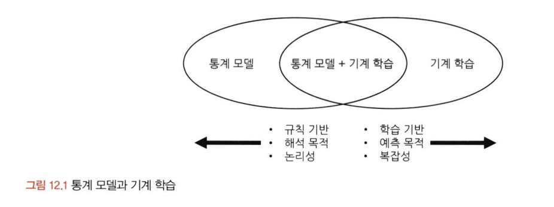

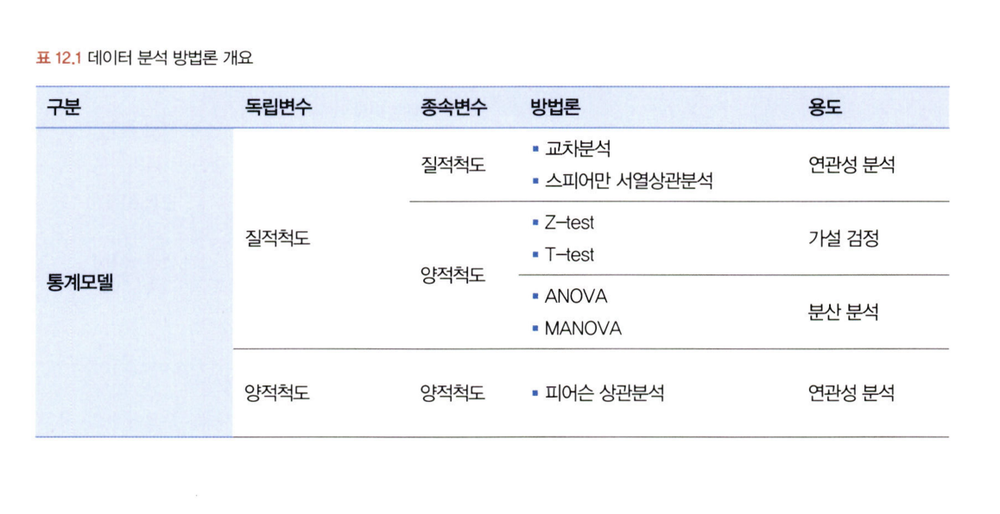
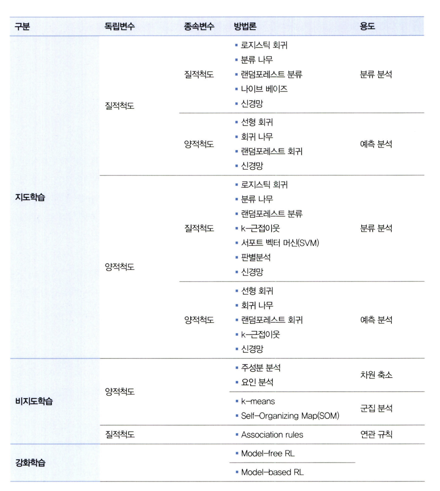

기계 학습 데이터 분석 방법론
1. 종속변수의 유무
에지도학습(Supervised learning) vs 비지도 학습(Unsupervised learning)  or 강화학습
(Reinforcement learning)

2. 독립변수와 종속변수의 속성
질적 척도인가 양적 척도인가에 따라 사용할 수 있는 분석 방법론이 다
르다. 물론 변수 형태에 따라 절대적으로 상호 배타적으로 구분되는 것은 아니다. 하나의 방법론이 양적 질적 변수 형태에 모두 사용가능한 경우도 있다.

회귀 모델은 (변수 가공이 필요하지만) 독립변수가 질적, 양적 변수인 경우 모두 사용 가능하며, k-근접이웃 모델의 경우 종속변수가 질적 척도인 경우와 양적 척도인 경우 모두에 사용 가능하다.

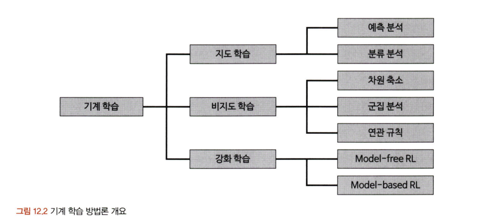

지도학습은 입력에 대한 정답이 주어져서 출력된 결팟값과 정답 사이의 오차가 줄어들도록 학습과 모델수정을 반복한다. 결팟값이 양적 척도면 회귀(Regression) 방식의 방법론을 사용하고, 결 값이 질적 척도면 분류(Classification) 방식의 방법론을 사용한다. 
자율학습으로도 불리는 비지도 학습은 별도의 정답이 없이 변수 간의 패턴을 파악하거나 데이터를 군집화하는 방법이다.

군집분석의 경우, 정답지(labeling) 없이 유사한 관측치들끼리 군집으로 분류하는 기법이다. 유사한 특성을 가진 것끼리 묶음으로써 각 집단의 특성을 분석한다. 
ex. 고객 세분화, 연관규칙 분석 등

강화학습: 동물이 시행착오(trial and error)를 통해 학습하는 과정을 기본 콘셉트로 한 방법 중 하나. 모델의 결과에 보상과 벌을 주면서 스스로 학습하게 하는 것

## 12.2. 주성분 분석(PCA)
<!-- 새롭게 배운 내용을 자유롭게 정리해주세요.-->
주성분 분석(Principal Component Analysis; PCA)은 여러 개의 독립변수들을 잘 설명해 줄 수 있는 주된 성분을 추출하는 기법임.

주성분 분석을 통해 전체 변수들의 핵심 특성만 선별하기 때문에 독립변수(차원)의 수를 줄일 수 있다. 차원의 저주(curse of dimensionality)를 방지하기위한 방법, 여러 개의 변수들이 소수의 특정한 소수의 변수들로 축약되도록 가공하는 것.

차원을 감소하는 방법
1. 변수 선택을 통해 비교적 불필요하거나 유의성이 낮은 변수를 제거하는 방법

2. 변수들의 잠재적인 성분을 추출하여 차원을 줄이는 방법
(주성분 분석, 공통요인분석) -> 요인추출모델의 대표적 방법

차원의 저주란?
변수가 늘어남에 따라 차원이 커지면서 분석을 위한 최소한의 필요 데이터 건수가 늘어나면서 예측이 불안정해지는 문제. 변수가 늘어날수록 과적합(overfitting)의 위험성이 증가한다. 또한 상관관계가 높은 변수로 인한 다중공선성 문제도 발생할 수 있음.

### PCA
다차원의 데이터 분포를 가장 잘 설명해 주는 성분들을 찾아주는 PCA는 데이터 공간에 위치하는 점들의 분산을 최대한 보존하는 축을 통해 차원을 축소하는 것이 핵심 요소임.
일반적으로는 제1주성분, 제2주성분만으로 대부분의 설명력이 포함되기 때문에 두 개의 주성분만 선정함.

데이터 분산을 가장 잘 표현하는 저차원 찾아내기
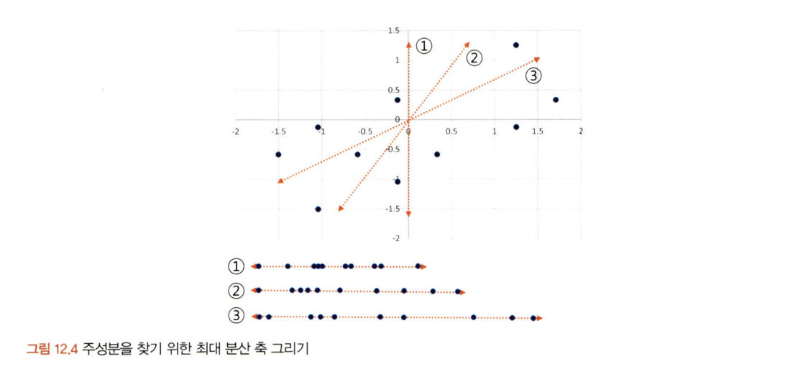

성분을 찾는 과정은 그림 12.5의 C 포인트로부터 직각으로 맞닿는 지점과 (0,0)의 거리가 최대가 되도록 하는 축을 찾는 것이다. 즉 각 포인트들이 직각으로 맞닿는 지점의 분포가 가장 넓게 퍼진 축을 구하는 것임. 따라서(0,0)으로부터 각 포인트들의 직각 지점까지의 거리의 합이 가장
큰 축이 주성분임.

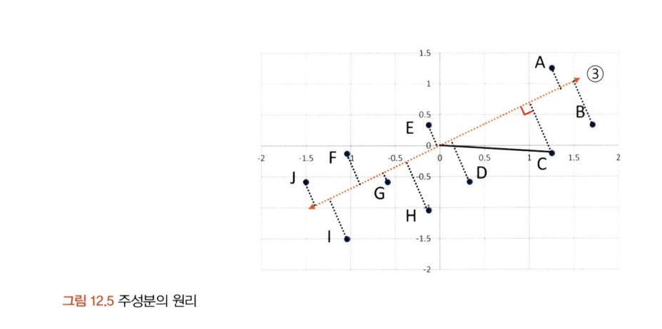

### 주성분 분석 실습
데이터 불러오기 및 확인
데이터 정규화 적용
9개의 주성분 생성 후 설명력 확인
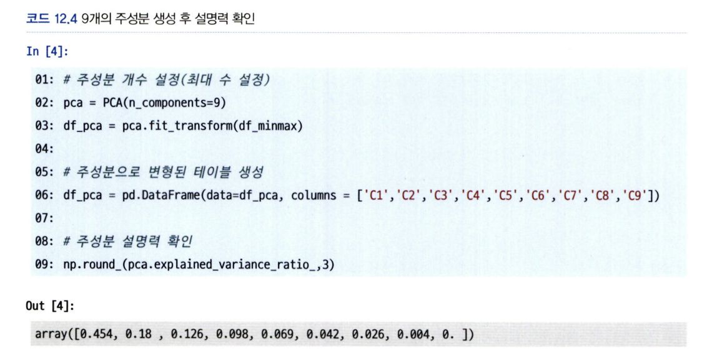

2개의 주성분 생성

주성분에 따른 종속변수 시각화
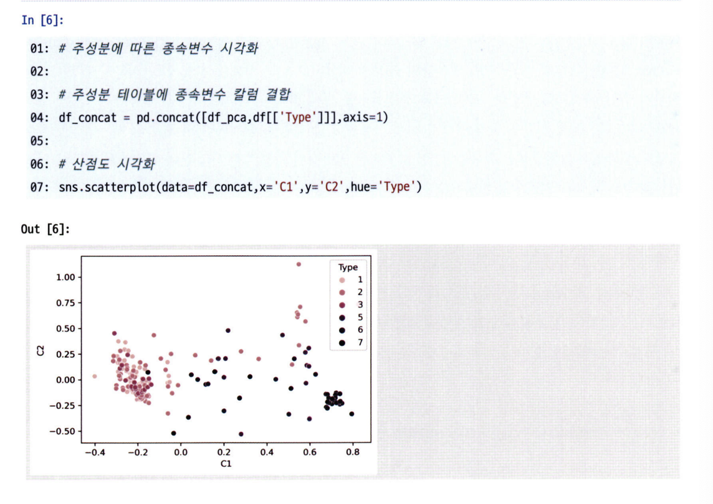

## 공통요인분석 (CFA)

## 12.4. 다중공선성 해결과 섀플리 밸류 분석
<!-- 새롭게 배운 내용을 자유롭게 정리해주세요.-->
PCA와 CFA는 요인분석(Factor Analysis; FA)을 하기 위한 기법의 종류요인분석을
하기 위해 전체 분산을 토대로 요인을 추출하는 PCA를 사용하거나 
공통분산만을 토대로 요인을 추출하는 CFA를 선택할 수 있다.

요인분석은 목적에 따라 탐색적 요인분석과 확인적 요인분석으로 구분
1. 탐색적 요인 분석:  변수와 요인 간의 관계가 사전에 정립되지 않거나 체계
화되지 않은 상태에서 변수 간의 관계를 알아보기 위해 사용

2. 확인적 요인분석(ConfirmatoryFactor Analysis; CFA)은 이미 변수들의 속성을 예상하고 있는 상태에서 실제로 구조가 그러한지 확인하기 위한 목적으로 사용

주성분 분석(PCA)은 전체 독립변수들을 잘 설명해줄 수 있는 주된 성분 두세 개를 추출하는 기법임. 공통요인분석(CFA) 역시 전체 독립변수를 축약한다는 점에서 PCA와 동일하지만 상관성이 높은 변수들을 묶어 잠재된 몇 개의 변수를 찾는다는 점에서 차이가 남.

PCA는 모든 독립 변수들의 총 변량(총 분산)을 기반으로 요인을 추출하기 때문에 전체 변수를 가장 잘 설명해 주는 순으로 주성분의 우위가 결정된다. 반면 CFA는 변수들 간의 공통 변량(공통분산)만을 기반으로 하여 요인을 추출함.

PCA나 CFA와 같은 요인분석을 하기 위해서는 우선 독립변수들 간의 상관성이 요인분석에 적합한지
검증을 해야 한다. 이를 확인하기 위한 방법으로 바틀렛(Bartlett) 테스트와 KMO(Kaiser-MeyerOlkin) 검정이 있음.
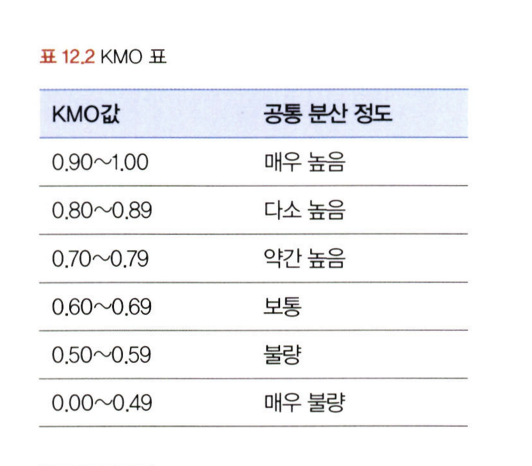

적합성을 검증한 후에는 요인분석을 통해 생성되는 주성분 변수들의 고유치(eigen value)를 확인하여 요인의 개수를 결정함. 고유치는 요인이 설명해 주는 분산의 양을 뜻하는 것으로, 요인에 해당하는 변수들의 요인 적재 값의 제곱 합 값들을 합해 구할 수 있음.

요인 적재 값(factor loading)을 통해 각 변수와 요인 간의 상관관계의 정도를 확인할 수 있음.

### 공통 요인 분석 실습
패키지 설치 및 임포트 (바틀렛 테스트, kmo 검정, 요인 시각화 등을 위한 패키지)
데이터 불러오기 및 확인
변수 선택 및 데이터 스케일 정규화
바틀렛 테스트
kmo 검정
전체 요인 적재 값 확인

## 데이터 마사지와 블라인드 분석
데이터 마사지:
데이터 분석 결과가 예상하거나 의도한 방향과 다를 때 데이터의 배열을 수정하거나 관점을 바꾸는 등 동일한 데이터라도 해석이 달라질 수 있도록 유도하는 것

### 데이터 마사지 방법
편향된 데이터전처리
매직그래프사용
분모 바꾸기 등 관점 변환
의도적인 데이터 누락 및 가공
머신러닝 모델의 파라미터 값 변경 및 연산반복
심슨의 역설

편향된 데이터 전처리: 이상치나 결측값 등의 전처리를 분석가가 의도하는 방향에 유리하도록 하는 것

매직 그래프 사용: 그래프의 레이블 간격이나 비율을 왜곡하여 수치의 차이를 실제보다 크거나 작게 인식하도록 유도하는 방법

분모 바꾸기 등 관점 변환 동일한 비율 차이라 하더라도 분모를 어떻게 설정하는가에 따라 받아들여
지는 느낌이 달라짐

의도적인 데이터 누락 및 가공: 데이터 분석가가 원하는 방향과 반대되는 데이터를 의도적으로 누락시키거나 다른 수치와 결합하여 특성을 완화시키는 방법

머신러닝 모델의 파라미터 값 변경 및 연산반복: 통계적 수치뿐만 아니라 머신러닝 모델의 결팟값도 어느 정도 유도가 가능함.

심슨의 역설: 데이터의 세부 비중에 따라 전체 대표 확률이 왜곡되는 현상을 의도적으로 적용하여 통계 수치를 실제와는 정반대로 표현할 수 있음

### 블라인드 분석
기존에 분석가가 중요하다고 생각했던 변수가 큰 의미가 없는 것으로 결과가 나왔을 때 무리해서 의미부여를 하거나 그 변수에 집착하여 해석에 유리하도록 변수를 가공하게 되는 실수를 방지하는 목적으로 사용

## 12.6. Z-test와 T-test
<!-- 새롭게 배운 내용을 자유롭게 정리해주세요.-->
집단 내 혹은 집단 간의 평균값 차이가 통계적으로 유의미한 것인지 알아내는 방법

Z-test와 T-test는 단일 표본 집단의 평균 변화를 분석하거나 두 집단의 평균값 혹은 비율 차이를 분석할 때 사용한다. 우선Z-test와 T-test는 분석하고자 하는 변수가 양적 변수이며, 정규 분포이며 등분산이라는 조건이 충족되어야 한다. 등분산 조건의 경우, bartlett 등분산성 검정을 통해 확인할 수 있으며, 등분산을 만족하면 equal variance t-test를 수행하고 만족하지 않으면 이분산이므로, Welch's 통계 기반 분석 방법론 331t-test를 수행함.

Z-test는 본래 모집단의 분산을 알 수 있는 경우에 사용되지만 모집단의 분산을 알 수 있는 경우가 거의 없음.

표본의 크기가 30 이상이면 중심 극한 정리에 의해 표본 평균분포가 정규분포를 따른다고 볼 수 있으므로 Z-test 사용이 가능함.
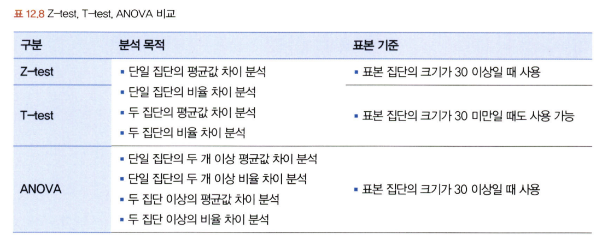

### z-test와 t-test 실습
패키지 임포트
데이터 불러오기 및 확인
골프공 타입별 통곗값 확인
그룹별 박스 플룻 시각화
정규성 검정
등분산성 검정
대응표본 z-test
독립표본 z-test
대응표본 t-test
독립표본 t-test

## 12.7. ANOVA
<!-- 새롭게 배운 내용을 자유롭게 정리해주세요.-->
세 집단이상의 평균 차이를 분석하는 방법
분산분석, F분포 사용
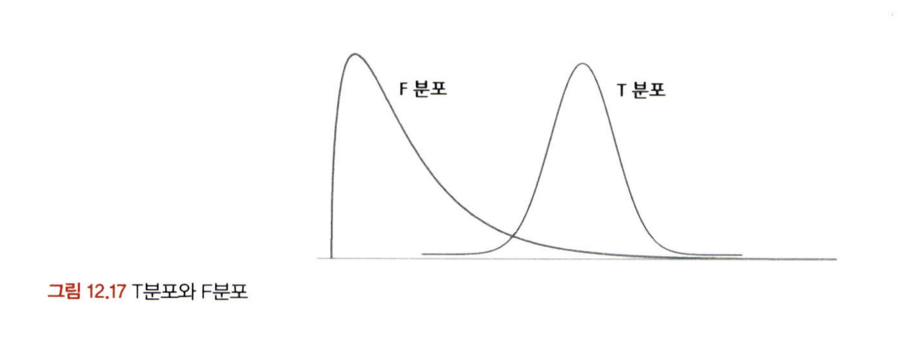

연속확률분포인 F분포는 두 모분산의 비교 및 검정을 위해 사용한다. 항상 양의 값을 가지며 오른쪽으로 긴 꼬리 형태를 보인다. ANOVA나 회귀분석 등에서 F분포를 통해 독립변수가 종속변수에 미치는 영향을 분석함.

ANOVA의 일반적인 가설의 형태
Ho(귀무가설): 독립변수(인자)의 차이에 따른 종속변수(특성 값)는 동일하다.
H(대립가설): 독립변수(인자)의 차이에 따른 종속변수(특성 값)는 다르다.

ANOVA는 독립변수인 요인의 수에 따라서 다르게 불림.

‘지역 하나라면 일원 분산분석(one-way ANOVA)
만약 요인이 '지역',‘연령대' 두 가지라면 이원 분산분석(two-way ANOVA)
더 많은 N 가지라면 N원 분산분석(N-wayANOVA)

독립변수는 집단을 나타낼 수 있는 범주(분류)형 변수이어야 하며, 종속 변수는 연속형 변수
ANOVA는 각 집단의 평균값 차이가 통계적으로 유의한지 검증
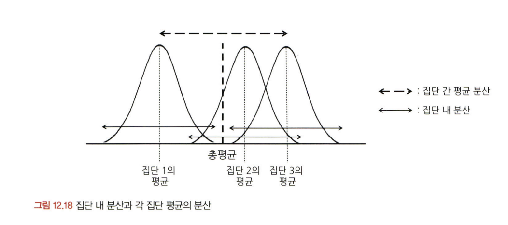

### 실습
패키지 임포트
데이터 불러오기 및 확인
stats 패키지로 anova 검정
ols 패키지 ANOVA 검정을 위한 데이터 재구조화
ols 패키지로 ANOVA 검정
사후검정수행


## 12.8. 카이제곱 검정(교차분석)
<!-- 새롭게 배운 내용을 자유롭게 정리해주세요.-->
카이제곱 검정(Chi-square test)은 교차분석(Crosstabs)이라고도 불리며, 명목 혹은 서열척도와 같은 범주형 변수들 간의 연관성을 분석하기 위해 결합분포를 활용하는 방법

'연령'과 같은 비율척도 변수는 ‘연령대’와 같은 서열척도로 변환해서 사용해야 한다. 기본 원리는 변수들간의 범주를 동시에 교차하는 교차표를 만들어 각각의 빈도와 비율을 통해 변수 상호 간의 독립성과 관련성을 분석하는 것

검정 통계량 카이 제곱(x²)을 통해 변수 간에 연관성이 없다는 귀무가설을 기각하는지 여부로 상관성이있고 없음을 판단함.

### 실습
패키지 임포트
데이터 불러오기 및 확인
성별, 흡연여부 집계
카이제곱 검정용 데이터셋 가공
성별 흡연자 수 시각화
카이제곱 검정 수행

<br>
<br>

# 확인 문제

### **문제 1.**
> **🧚 경희는 다트비 교육 연구소의 연구원이다. 경희는 이번에 새롭게 개발한 교육 프로그램이 기존 프로그램보다 학습 성취도 향상에 효과적인지 검증하고자 100명의 학생을 무작위로 두 그룹으로 나누어 한 그룹(A)은 새로운 교육 프로그램을, 다른 그룹(B)은 기존 교육 프로그램을 수강하도록 하였다. 실험을 시작하기 전, 두 그룹(A, B)의 초기 시험 점수 평균을 비교한 결과, 유의미한 차이가 없었다. 8주 후, 학생들의 최종 시험 점수를 수집하여 두 그룹 간 평균 점수를 비교하려고 한다.**   

> **🔍 Q1. 이 실험에서 사용할 적절한 검정 방법은 무엇인가요?**

```
독립표본 t-검정
```

> **🔍 Q2. 이 실험에서 설정해야 할 귀무가설과 대립가설을 각각 작성하세요.**

```
귀무가설: 두 그룹(A, B)의 최종 시험 점수 평균은 같다.
대립가설: 두 그룹(A, B)의 최종 시험 점수 평균은 다르다.
```

> **🔍 Q3. 검정을 수행하기 위한 절차를 순서대로 서술하세요.**

<!--P.337의 실습 코드 흐름을 확인하여 데이터를 불러온 후부터 어떤 절차로 검정을 수행해야 하는지 고민해보세요.-->

```
가설설정, 유의수준(알파)설정, 데이터 수집 및 요약, 정규성 및 등분산성 검토, 검정통계량 값 계산, p-value 계산, 결과 해석 및 가설검정, 결론도출 및 보고
```

> **🔍 Q4. 이 검정을 수행할 때 가정해야 하는 통계적 조건을 설명하세요.**

```
두 그룹간 독립성, 두 그룹 점수분포의 정규성, 두 그룹 점수분포의 등분산성
```

> **🔍 Q5. 추가적으로 최신 AI 기반 교육 프로그램(C)도 도입하여 기존 프로그램(B) 및 새로운 프로그램(A)과 비교하여 성취도 차이가 있는지 평가하고자 한다면 어떤 검정 방법을 사용해야 하나요? 단, 실험을 시작하기 전, C 그룹의 초기 점수 평균도 A, B 그룹과 유의미한 차이가 없었다고 가정한다.**

```
일원분산분석
```

> **🔍 Q6. 5번에서 답한 검정을 수행한 결과, 유의미한 차이가 나타났다면 추가적으로 어떤 검정을 수행해 볼 수 있을까요?**

```
사후검정
```

---

### **문제 2. 카이제곱 검정**  
> **🧚 다음 중 어떠한 경우에 카이제곱 검정을 사용해야 하나요?   
1️⃣ 제품 A, B, C의 평균 매출 차이를 비교하고자 한다.  
2️⃣ 남성과 여성의 신체 건강 점수 평균 차이를 분석한다.  
3️⃣ 제품 구매 여부(구매/미구매)와 고객의 연령대(10대, 20대, 30대…) 간의 연관성을 분석한다.  
4️⃣ 특정 치료법이 환자의 혈압을 감소시키는 효과가 있는지 확인한다.**  

```
3️⃣ 제품 구매 여부(구매/미구매)와 고객의 연령대(10대, 20대, 30대…) 간의 연관성을 분석한다.  
```

### 🎉 수고하셨습니다.