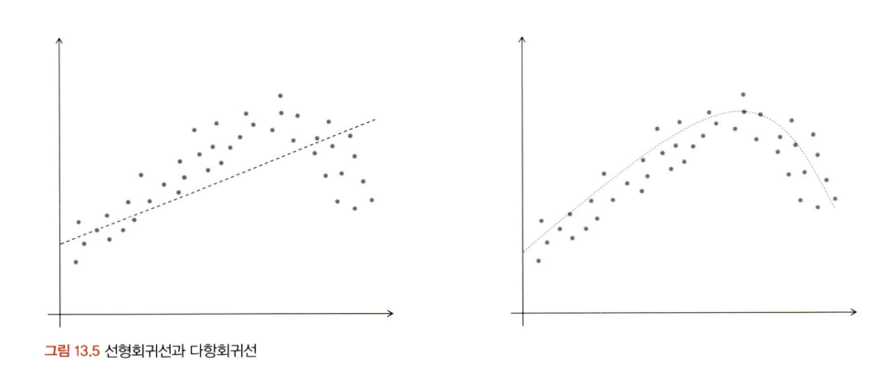
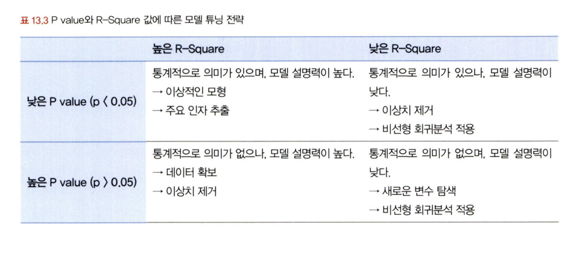

# 통계학 7주차 정규과제

📌통계학 정규과제는 매주 정해진 분량의 『*데이터 분석가가 반드시 알아야 할 모든 것*』 을 읽고 학습하는 것입니다. 이번 주는 아래의 **Statistics_7th_TIL**에 나열된 분량을 읽고 `학습 목표`에 맞게 공부하시면 됩니다.

아래의 문제를 풀어보며 학습 내용을 점검하세요. 문제를 해결하는 과정에서 개념을 스스로 정리하고, 필요한 경우 추가자료와 교재를 다시 참고하여 보완하는 것이 좋습니다.

7주차는 `3부. 데이터 분석하기`를 읽고 새롭게 배운 내용을 정리해주시면 됩니다.


## Statistics_7th_TIL

### 3부. 데이터 분석하기
### 13.머신러닝 분석 방법론
### 14.모델 평가


## Study Schedule

|주차 | 공부 범위     | 완료 여부 |
|----|----------------|----------|
|1주차| 1부 p.2~56     | ✅      |
|2주차| 1부 p.57~79    | ✅      | 
|3주차| 2부 p.82~120   | ✅      | 
|4주차| 2부 p.121~202  | ✅      | 
|5주차| 2부 p.203~254  | ✅      | 
|6주차| 3부 p.300~356  | ✅      | 
|7주차| 3부 p.357~615  | ✅      | 

<!-- 여기까진 그대로 둬 주세요-->

# 13.머신러닝 분석 방법론

```
✅ 학습 목표 :
* 선형 회귀와 다항 회귀를 비교하고, 데이터를 활용하여 적절한 회귀 모델을 구축할 수 있다. 
* 로지스틱 회귀 분석의 개념과 오즈(Odds)의 의미를 설명하고, 분류 문제에 적용할 수 있다.
* k-means 알고리즘의 원리를 설명하고, 적절한 군집 개수를 결정하여 데이터를 군집화할 수 있다.
```

## 13.1. 선형 회귀분석과 Elastic Net(예측모델)
<!-- 새롭게 배운 내용을 자유롭게 정리해주세요.-->
<!-- `13.1.3. Ridge와 Lasso 그리고 Elastic Net` 부분은 제외하고 학습하셔도 무방합니다.-->
회귀분석은 해당 객체가 소속된 집단의 X(독립변수) 평균값을 통해 Y(종속변수) 값을 예측하는
것이 기본적인 원리

회귀 분석을 한 마디로 정의하면, “종속변수Y의 값에 영향을 주는 독립변수 X들의 조건을 고려하여 구한 평균값”

회귀선은 절편, 기울기, 오차항으로 이루어진다. 오차항은 독립변수가 종속변수에 주는
영향력을 제외한 변화량

회귀분석은 이 오차항을 최소화하는 절편과 기울기를 구하는 것
y = Bo+BX++BX+ €


예측치와 관측치들 간의 수직 거리(오차)의 제곱합을 최소로 하는 직선
이 회귀선 -> 최소제곱추정법(Least squares estimation)

회귀선을 구하기 위해 잔차제곱합(RSS)을 최소화하는 알파(a)와 베타(ẞ) 값을 찾는 것을 의미한
다. 이는 미분을 통해 구할 수 있다. 최소제곱추정법을 사용하는 이유는 당연하게도 예측 정확도를 높이기 위함이다. 이것은 최대우도추정법(Maximum likelihood estimation)으로써 변수x₁, X₂,… X„이주어졌을 때 예측값心이 관측될 가능도(likelihood)를 최대화하는 것이 곧 오류의 제곱합을 최소화하는 것과 동일한 것이다.


독립변수가 하나인 회귀분석은 단순 회귀분석(Simple regression analysis) 혹은 단변량 회귀분석 두 개 이상이면 다중 회귀 분석(Multiple regression analysis) 혹은 다변량 회귀분석

기본 조건 충족

잔차의 정규성: X(독립변수)에 해당되는 Y(종속변수)의 값들의 잔차는 정규분포를 해야 한다.
잔차의 등분산성: 잔차의 분산은 회귀 모형의 독립 변숫값과 상관없이 일정해야 한다.
독립성: 독립변수들 간에 상관관계가 없어야 한다. (다중 선형회귀)
선형성: X(독립변수) 값의 변화에 따른 Y(종속변수) 값의 변화는 일정해야 한다.


## 다항 회귀
독립변수와 종속변수의 관계가 곡선형 관계일 때 변수에 각 특성의 제곱을 추가하여 회귀선을 곡선형으로 변환하는 모델


T Value는 노이즈 대비 시그널의 강도
유의도를 나타내는 P Value는 T Value와 관측치 수에 의해 결정되는 값
다중공선성을 판단할 수 있는 Tolerance와 VIF는 공차한계와 분산팽창지수

변수 선택 알고리즘
전진 선택법(Forward Selection)
후진 제거법(Backward Elimination)
단계적 선택법(Stepwise Selection)

## Ridge와 Lasso 그리고 Elastic Net
 
Ridge는 전체 변수를 모두 유지하면서 각 변수의 계수 크기를 조정
Lasso는 Ridge와 유사하지만, 중요한 몇 개의 변수만 선택하고 나머지 변수들은 계수를 0으로 주어 변수의 영향력을 아예 없앤다는 차이


Elastic Net은 Ridge와 Lasso의 최적화 지점이 다르기 때문에 두 정규화 항을 결합하여 절충한 모델이다. Ridge는 변환된 계수가 0이 될 수 없지만 Lasso는 0이 될 수 있다는 특성을 결합한 것




## 13.2. 로지스틱 회귀분석 (분류모델)
<!-- 새롭게 배운 내용을 자유롭게 정리해주세요.-->
로지스틱 회귀분석은 특정 수치를 예측하는 것이 아니라 어떤 카테
고리에 들어갈지 분류를 하는 모델

기본 이항 로지스틱 회귀 분석
로지스틱 회귀는 기존의 선형회귀식의 사상은
그대로 유지하되 종속변수를 1이 될 확률로 변환하여 그 확률에 따라 0과 1의 여부를 예측함


로짓 회귀선으로 변환해주기 위해서는 우선 오즈 값을 구해야 한다. 오즈란 사건이 발생할 가능성이 발생하지 않을 가능성보다 어느 정도 큰지를 나타내는 값


오즈 값에 로그를 취하면 양의 무한대에서 음의 무한대를 갖는 형태가 됨.
로지스틱 회귀분석은 사건 발생 확률을 0에서 1사이로 변환해서 표현

로지스틱 회귀 분석의 결과 해석 방법을 알아보자. 일반 이항 로지스틱 회귀 분석을 실행한 모형 결
과는 선형 회귀분석과 유사한 형식으로 나온다. 우선 각 변수에 대한 계숫값과 유의도를 확인할 수 있다.모든 변수의 값과 계슷값을 앞에서 나왔던 로지스틱 회귀식에 대입해 주면 예측 확률을 구할 수 있다.

선형 회귀분석 모형 결과와 차이가 있다면, 각 변수의 오즈비를 알 수 있다는 것이다. 독립변수 X1은 1이 커질 때마다 혹은 더미변수라면 1일 때 0에 비해 1.223배 종속변수가1일 확률이 높다는 것이다. X3은 오즈비가 1보다 작기 때문에 오히려 확률이 줄어든다는 뜻이고, 계수도-0.029로 종속변수가 1로 분류될 확률에 음(-)의 관계를 갖는다.

## 13.8. k-means 클러스터링(군집모델)
<!-- 새롭게 배운 내용을 자유롭게 정리해주세요.-->
k-means 클러스터링 분석 방법은 앞에서 다루었던 KNN(K-Nearest Neighbors)과 비슷한 듯하면서도 전혀 다른 모델
k-means 클러스터링은 비지도학습
k-means 클러스터링은 미리 가지고 있는 정답(레이블) 없이 데이터의 특성과 구조를 발견
해 내는 방식
k-means 클러스터링은 군집화 알고리즘 중에서 구현 방법이 매우 간단하고 실행 속도가 빠르기 때
문에 많이 사용됨.

K-means 방식 외에 DBSCAN, Mean-shift clustering, Agglomerative
hierarchical clustering 등 다양한 클러스터링 기법이 있다. 각각 군집을 나누는 방식이 다르기 때문에 데이터의 상황에 따라 알맞은 알고리즘을 선택하여 군집화해야 함.

k-means 클러스터링이라는 이름에서 k는 분류할 군집의 수를 뜻한다. K를 3으로 설정하면 전체 관측치를 3개의 군집으로 분류함

중심점과 군집 내 관측치 간의 거리를 비용함수로 하여 이 함수 값이 최소화되도록 중심점과 군집을 반복적으로 재정의


## k수 선정 법
비즈니스 도메인 지식을 통한 개수 선정
엘보우 기법(Elbow method)이다. 이는 군집 내 중심점과 관측치 간 거리 합(Inertia
value)이 급감하는 구간의 k 개수를 선정하는 방법
실루엣 계수(Silhouette coefficient)를 활용하여 적정 k 수를 찾기


이런 경우에는
밀도 기반의 원리를 이용한 클러스터링 기법이 DBSCAN(Densitybased spatial clustering of applications with noise)


# 14. 모델 평가

```
✅ 학습 목표 :
* 유의확률(p-value)을 해석할 때 주의할 점을 설명할 수 있다.
* 분석가가 올바른 주관적 판단을 위한 필수 요소를 식별할 수 있다.
```

## 14.3. 회귀성능 평가지표
<!-- 새롭게 배운 내용을 자유롭게 정리해주세요.-->

### R-Square와 Adjusted R-Square
R-Square(R²)는 모델의 독립변수들이 종속변수를 설명할 수 있는 설명력을 나타내는 0 에서 1 사이의 수치

SSR(Sum of square regression)은 회귀식의 추정값과 전체 실젯값 평균과의 편차 제곱합

SSE(Explained sum of squares)는 회귀식의 추정값과 실젯값 편차 제곱의 합

SST(Total sum of squares)는 실젯값과 전체 실젯값 평균과의 편차 제곱합


Adjusted R-Square는 R-Square가 독립 변수의 개수가 많아질수록 값이 커지는 문제를 보정한 기준

### RMSE(Root Mean Square Error)
RMSE는 편차 제곱의 평균에 루트를 씌운 값으로, 실제 수치와 예측한 수치와의 차이를 확인하는 전형적인 방법. 실젯값과 예측값의 표준편차를 구하는 것

예측값과 실젯값의 차이가 평균적으로 어느 정도인지 측정할 수 있어 직관적으로 모델의 정확도를 가늠할 수 있다. 그런데 RMSE는 예측값의 스케일에 영향을 받는다. 종속변수의 단위가 커지면 RMSE도 커지는 것이다.그래서 모델 간 정확도 비교를 할 때, 표본 데이터가 다르면 RMSE 절대치로 비교를 해서는 안 된다. 

### MAE
MAE는 실젯값과 예측값의 차이 절댓값 합을 n으로 나눈 값이다. 그렇기 때문에 직관적으로 예측값 차이를 비교할 수 있다. 
RMSE는 ‘평균 제곱 오차'고, MAE는 ‘평균 절대 오차'다. 즉 RMSE는 제곱한 오차 평균에 제곱근을 해준것이고, MAE는 오차 절댓값의 평균을 구한 것이다. 두 지표 모두 예측값과 실젯값의 차이를 평균한 값이지만 계산 방식이 다르기 때문에 특성도 차이가 있다. 

### MAPE
백분율 오차인 MAPE는 MAE를 퍼센트로 변환한 것이다. 따라서 스케일에 관계없이 절대적인 차이를
비교할 수 있으므로 다른 데이터가 들어간 모델 간 성능을 비교하기에 유용하다. MAPE값은 0부터 무한대의 값을 가질 수 있으며, 0에 가까울수록 우수한 모델이다. 산출 공식은 다음과 같다.

실젯값에 0이 많은 데이터는 MAPE 평가 기준을 사용하는 것이 적합하지 않다.

### RMSLE(Root Mean Square Logarithmic Error)
RMSLE는 앞에서 알아본 RMSE와 동일한 수식에서 실젯값과 예측값에 1을 더해준 다음 로그를 취해준 평가 방식이다. 로그를 취해 줌으로써 MAPE와 마찬가지로 상대적 비율을 비교할 수 있다. 그러한 연유로 RMSLE는 RMSE보다 오차 이상치에 덜 민감하다. 그래서 실젯값에 이상치가 존재하는 경우에 적당한 방식이다. 로그를 취하기 전에 1을 더해주는 이유는, 실젯값이 0일 때, log이 무한대로 수렴할 수 있기 때문이다.

###  AIC와 BIC
AIC(Akaike's Information Criterion)는 최대 우도(likelihood)
에 독립변수가 얼마나 많은가에 따른 페널티를 반영하여 계산하는 모델 평가 척도다

AIC값은 작을수록 좋은 모델이며 우도가 높을수록, 변수가 적을수록 값은 작아진다. 변수가 늘어날수록 모델의 편의(bias)는 감소하지만 분산(variance)은 증가한다. AIC는 적정한 변수의 개수를 찾는 데에  유용한 모델 평가 방법이다.

## 14.6. 유의확률의 함정
<!-- 새롭게 배운 내용을 자유롭게 정리해주세요.-->

p값은 표본의 크기가 커지면 점점 0으로 수렴하게 되는 특성이 있다. 표본의 크기가 커지면 표본
오차가작아지고, 결과적으로 p값도 작아지게 되는 것이다. 예를 들어 연 소득과 기부 여부 간의 관계를 알아보기 위한 분석을 수행했을 때, 표본이 30명인 상태에서는 p값이 0.05보다 크게 나왔다가, 표본을 300명으로 늘리니 p값이 0.05 미만으로 줄어드는 현상이 발생할 수 있다. 물론 표본을 증가시켰을 때 확실한 차이를 나타내는 관측치들이 추가되어 그런 것일 수도 있다. 하지만 표본이 30명일 때와 300명 일 때의 기부 여부에 대한 연 소득 차이는 같을 수도 있다.


## 14.7. 분석가의 주관적 판단과 스토리텔링
<!-- 새롭게 배운 내용을 자유롭게 정리해주세요.-->
AI, 딥러닝이 발전했다 해도 아직 데이터 분석가의 역할
은 중요하다. 올바른 데이터를 선택하고 결론을 이끌어 내려면, 사람의 지식과 상식, 그리고 창의성이 필요하다. 왜냐하면 데이터에서는 나타나지 않는 사람들의 심리적 요소가 있기 때문이다.
특정 이슈에 대해서는 사람의 인사이트와 결정적 판단이 매우 중요하다. 

분석가는 검증 결과를 통해 새로운 정보를 얻을 수 있으며 이를 통해 데이터와 모델에 대한 인사이트를 높여 보다 좋은 판단을 내릴 수 있다.

분석가의 올바른 주관적 판단을 위한 필수 요소
해당 분야의 풍부한 도메인 지식
통계적 지식을 기반으로 탐색적 데이터 분석(EDA)과 전처리
적극적인 커뮤니케이션과 데이터. 모델 검증


<br>
<br>

# 확인 문제

## **문제 1. 선형 회귀**

> **🧚 칼 피어슨의 아버지와 아들의 키 연구 결과를 바탕으로, 다음 선형 회귀식을 해석하세요.**  
> 칼 피어슨(Karl Pearson)은 아버지(X)와 아들(Y)의 키를 조사한 결과를 바탕으로 아래와 같은 선형 회귀식을 도출하였습니다. 아래의 선형 회귀식을 보고 기울기의 의미를 설명하세요. 
>  
> **ŷ = 33.73 + 0.516X**  
>   
> - **X**: 아버지의 키 (cm)  
> - **ŷ**: 아들의 예상 키 (cm)  

```
여기에 답을 작성해주세요!
아버지의 키가 1cm 증가할 때, 아들의 예상 키는 평균적으로 약 0.516cm 증가합니다.
```
---

## **문제 2. 로지스틱 회귀**  

> **🧚 다트비에서는 학생의 학업 성취도를 예측하기 위해 다항 로지스틱 회귀 분석을 수행하였습니다. 학업 성취도(Y)는 ‘낮음’, ‘보통’, ‘높음’ 3가지 범주로 구분되며, 독립 변수는 주당 공부 시간(Study Hours)과 출석률(Attendance Rate)입니다. 단, 기준범주는 '낮음' 입니다.**   

| 변수 | Odds Ratio Estimates | 95% Wald Confidence Limits |  
|------|----------------------|--------------------------|  
| Study Hours | **2.34** | (1.89, 2.88) |  
| Attendance Rate | **3.87** | (2.92, 5.13) |  

> 🔍 Q1. Odds Ratio Estimates(오즈비, OR)의 의미를 해석하세요.

<!--변수 Study Hours의 오즈비 값이 2.34라는 것과 Attendance Rate의 오즈비 값이 3.87이라는 것이 각각 무엇을 의미하는지 구체적으로 생각해보세요.-->

```
다른 조건이 일정할 때,주당 공부 시간이 1시간 증가할수록,
학생이 ‘보통’ 또는 ‘높음’ 성취도에 속할 오즈는
→ ‘낮음’ 성취도에 속할 오즈보다 약 2.34배 커진다는 것.


```
> 🔍 Q2. 95% Wald Confidence Limits의 의미를 설명하세요.
<!--각 변수의 신뢰구간에 제시된 수치가 의미하는 바를 생각해보세요.-->

```
95%의 신뢰 수준에서, 모집단의 실제 오즈비(true odds ratio)가
주어진 구간 안에 존재할 것이라고 통계적으로 추정하는 범위;.

```

> 🔍 Q3. 이 분석을 기반으로 학업 성취도를 향상시키기 위한 전략을 제안하세요.
<!--Study Hours와 Attendance Rate 중 어느 변수가 학업 성취도에 더 큰 영향을 미치는지를 고려하여, 학업 성취도를 향상시키기 위한 효과적인 전략을 구체적으로 제시해보세요.-->

```
출석률의 오즈비가 더 크므로, 먼저 출석률 관리에 집중하는 것이 효과적이다.
출석률을 올릴 수 있는 철저한 관리 시스템을 도입하자.
```

---

## **문제 3. k-means 클러스터링**

> **🧚 선교는 고객을 유사한 그룹으로 분류하기 위해 k-means 클러스터링을 적용했습니다. 초기에는 3개의 군집으로 설정했지만, 결과가 만족스럽지 않았습니다. 선교가 최적의 군집 수를 찾기 위해 사용할 수 있는 방법을 한 가지 이상 제시하고 설명하세요.**

```
실루엣 분석을 진행한다.
각 데이터 포인트에 대해 군집 응집도와 분리도를 함께 고려한 점수(Silhouette score)를 계산함..
```

### 🎉 수고하셨습니다.