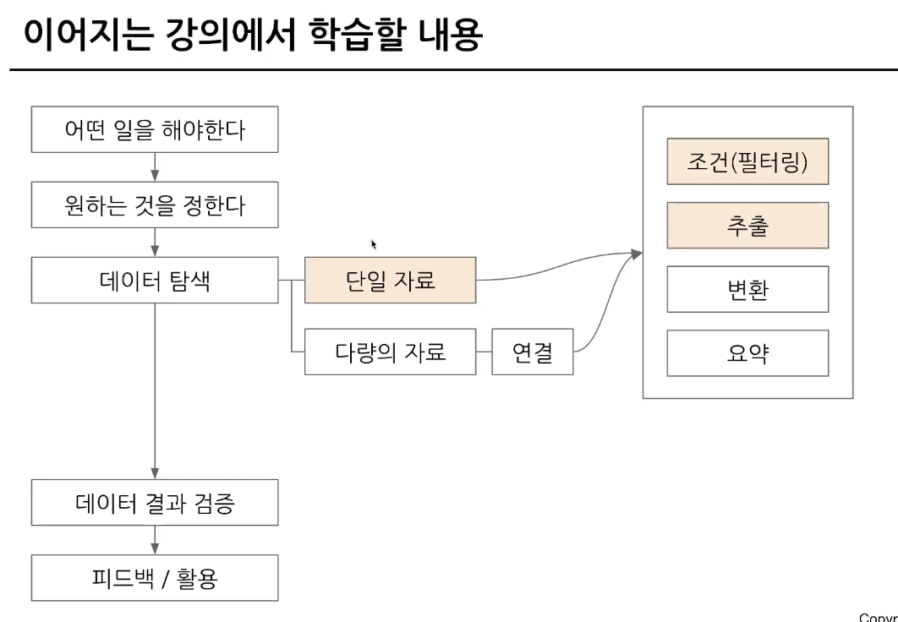
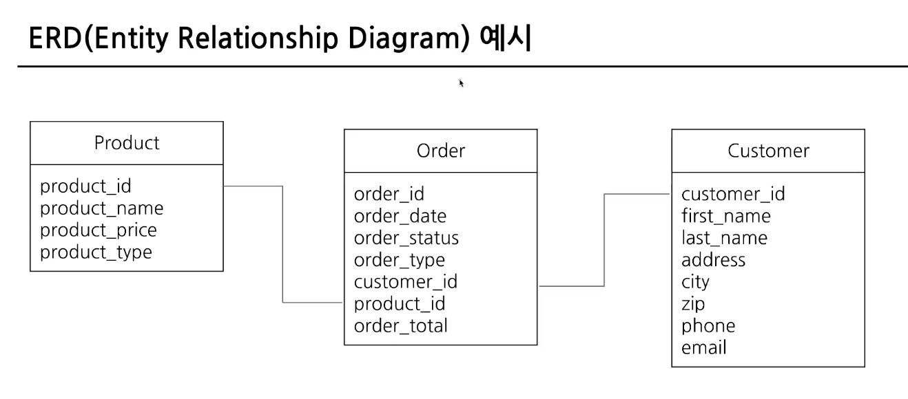
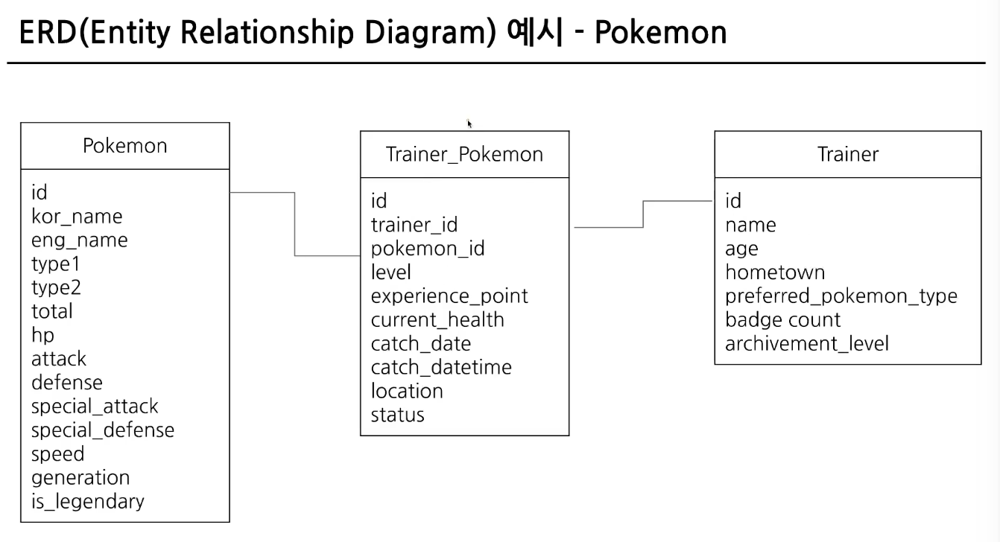
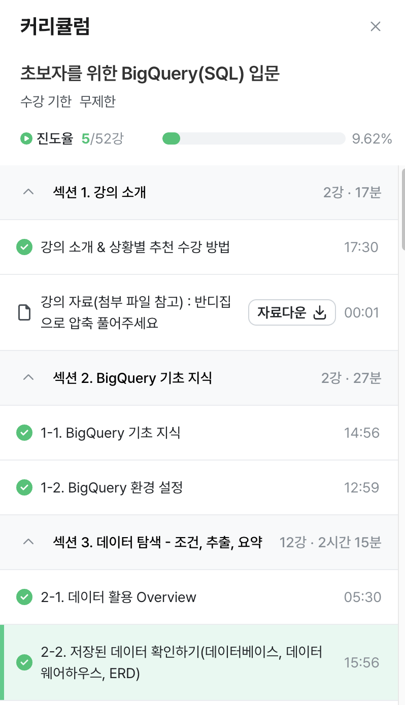

# 0주차 과제

## 1-1 BigQuery 기초지식

#### 데이터는 데이터베이스 테이블 등에 저장 
- Database: 데이터 저장소
- Table: 데이터가 저장된 공간
- MySQL, Oracle, PostgreSQL 같은 데이터베이스에 주로 저장

#### 데이터베이스의 특징 -> OLTP
- 거래를 하기 위해 사용되는 데이터 베이스
- 데이터 추가, 변경이 많이 발생
- 데이터 추출은 가능하나 느리다.

#### SQL: 데이터베이스의 데이터 관리를 위해 설계된 특수 프로그래밍 언어
- 행(row)하나가 고유한 데이터. 가로로 한줄
- 열(column) 특정 속성 값, 세로

#### OLAP와 데이터 웨어하우스의 등장
- OLTP -> 속도, 기능 부족 -> OLAP 등장
- OLAP: 분석 기능 제공
- 데이터 웨어하우스: 데이터를 한 곳에 모아서 저장 (웹 크롤링 등)

#### BigQuery 장점
- SQL로 쉽게 데이터 추출 가능
- OLAP 도구로 속도 빠름
- Firebase, GA4 등으로 쉽게 추출 가능
- 구글에서 인프라 관리 가능
- 적은 비용

## 1-2 BigQuery 환경설정
1) 프로젝트: 하나의 큰 건물. 하나 프로젝트에 여러 데이터셋 존재 가능
2) 데이터셋: 프로젝트에 있는 창고. 각 창고 공간에 데이터 저장 가능. 하나 데이터셋에 다양한 테이블 존재 가능
3) 테이블: 창고에 있는 선반. 테이블 안에 행과 열로 이루어진 데이터들 저장
(Google cloud에서 기본 세팅하는 방법에 대해서도 다루었는데, 추가로 알아갈 수 있어 좋았다)

## 2-1 데이터 활용 Overview

#### 데이터를 활용하는 과정
- 어떤 일을 할지, 원하는 것을 정한다. (문제정의)
- 데이터 탐색 진행 (단일자료 / 다량의 자료의 경우 연결)
- 이후 데이터를 조건, 추출, 변환, 요약 진행
- 결과 나오면 데이터 결과 검증 (매우 중요!)
- 피드백 활용 (다시 데이터 탐색, 활용)
- 데이터 탐색, 결과 검증에서 SQL 활용 가능

(데이터 활용 방법,과정에 대해 순서대로 자세하게 알 수 있었다.)

## 2-2 저장된 데이터 확인하기

#### SQL 쿼리를 작성하기 전에
- 데이터가 어떻게 저장되어 있는지
- 어떤 데이터가 저장되어 있는가
- 컬럼의 의미는 무엇인가
(쿼리 작성시 데이터 확인, 문제정의 필수!)
- 데이터 추출 전 데이터 웨어하우스에 데이터가 어떻게 저장되어 있는지 확인

#### 데이터가 저장되는 형태
- ERD: 데이터베이스 구조를 한눈에 알아보기 위해 사용
- 테이블: order, product 등
- order: 주문. (어떤 형태의 데이터들이 들어가 있는지 확인!)
(데이터가 어디에 있고, 어떤 데이터인지 확인)

#### 데이터가 저장되는 형태를 알려면?
- 데이터베이스를 직접 보면서 탐색
- 어떤 테이블이 존재?
- 어떤 컬럼이 존재?
- 연결시 어떤 컬럼 사용?
- 컬럼 값들의 의미
- 스프레드시트나 문서로 따로 정리해두기

#### 회사에 존재할 수 있는 데이터
1) 서비스에 사용될 데이터베이스
2) 앱/웹 로그데이터
3) 공공 데이터, 서드파티 데이터

#### 포켓몬 세상을 데이터로 생각해보기
- 포켓몬 세상엔 어떤 데이터가 존재할까?
- 포켓몬, 트레이너, 유저 배틀, 상점 등...

#### 포켓몬 데이터 BigQuery에서 확인하기
- 저장된 데이터 확인하면서 데이터 정리 및 ERD 그리기

(저장 방법, 데이터 정리 방법에 대해 자세하게 알 수 있었다)

